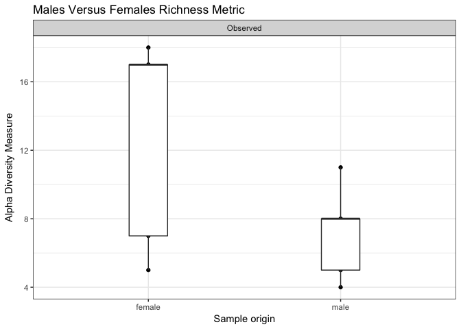
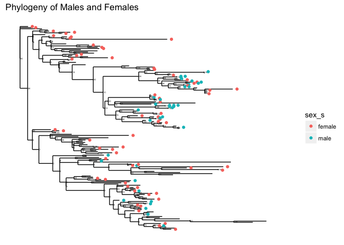

Analysis Report 1: Your Title Here
================
Katelyn Kukar
November 01, 2017

Introduction
============

Methodology to estimate microbial diversity has significantly increased with an effort to understand the distribution and diversity of microbes in their natural environments. Cultivation-dependent methodology work to mimic the natural environment of microbes in a laboratory setting, with enrichment cultures being particularly important for visualizing species that favor the selected media for growth (Swanson, 2016). Different ecological metrics have been used to categorize these cultivated colonies in order to deduce community data about known bacterial species and potentially deduce information about unknown species (Birtel, 2015). Understanding the cultivation methodology to successfully grow microbial species lends information about the requirements imperative for biodiverse communities that can be beneficial in studying niche environments like the human gut which interact with pathogens and probiotics (Wu, 2012). Beyond healthcare, general dispersal of bacterial communities increases biodiversity in water sources, soils, and all microenvironments that effect the wellbeing of the larger ecosystem, with this assumption also holding true for bacterial organisms which reside on a human host or human host environment (Fuhrman, 1999).

Within the paper Forensic identification using skin bacterial communities, published in 2010 by Noah Fierer the diversity in human skin bacterial communities is explained to be “far higher than previously recognized, with a high degree of inter-individual variability in the composition of bacterial communities.” This discovery leads the paper to discuss that these individualized communities can be utilized as personal identifiers for criminal cases as forensic evidence. Fierer et al. specifically claims that “these skin bacteria may persist on touched surfaces for prolonged periods because many are highly resistant to environ- mental stresses, including moisture, temperature, and UV radiation,” meaning the community samples can be collected long after the host has left. Though the implications for forensic research are still under scrutiny, the data can be more broadly analyzed to deduce if there are specific differences in bacterial communities between female and male participants. By analytically evaluating these communities separately to find patterns in abundance, richness, and diversity we deduce information about the specific community composition, which can yield information about the overall biodiversity of the niche the bacteria are a part of. The inference that human hosts hold their own unique sets of bacteria helps foster the notion of unique microenvironments that endosymbiotically regulate the human body.

By explicitly looking at community differences between male and female participants information can be gathered about the overall health and well-being of each participant sex in regard to the surrounding environment. In a study published in Science in 2013, it was discovered that the gut microbiota is extremely relevant in determining autoimmune disease susceptibility (Markle, 2013). Markle et al. stated that when male cecal contents were transferred to female mice these mice received a higher level of protection against “pancreatic islet inflammation, autoantibody production, and the development of diabetes,” meaning this difference within the sexes microbiota was translational to inhibit the spread of disease (Markle et al). Therefore, understanding the differences in the skin microbiota could also potentially pose interesting medical questions that could yield insight on diseases current to specific, sexually biased traits.

Overall, divulging community data analysis from female and male participants, from the sequenced data sets from the Fierer et. al paper, can provide useful information about the resident skin microbiota of sexually diverse humans. By using sex as the means of a comparison further hypotheses can be made that explain differences based on hormonal differences and social differences since the presiding environment remains constant for both sample sets. We can thereby infer that because of these differences a community the female and male sex of humans house a community of bacteria that are significantly different in regard to diversity, richness, and abundance on human hands. We test this hypothesis utilizing computational amplicon sequencing analyses that parse data particular to the bacterial communities found within the Fierer et al paper.

Methods
=======

Sample origin and sequencing
----------------------------

### Sample collection

All analysis was done using Fierer et al. as a reference source for sequence data and sample origins. Within the paper it is stated that samples were taken from nine healthy adults (four female, five male) who worked within the same building at the University of Colorado between ages 18-40. The samples taken included computer mouse swabs touched by the owner 12h before swabbing and the palm of the individual's dominant hand used to operate the mouse. Individuals were required to maintain normal hygiene habits prior to the swab as to not increase variation. The swabs were taken using autoclave cotton-tipped swabs that were autoclave and pre-moistened with a sterile solution. The swabbing took place for 10s per sample taken with all samples being kept at -80C for less than a week before DNA extraction (Fierer et al).

### DNA and Pyrosequencing

Fierer et al. explains that for each sample the 16s rRNA genes were amplified using the MO BIO PowerSoil DNA Isolation kit with the broken, frozen cotton swabs. These tubes were then horizontally shaken and kit procedures were followed for extraction. PCR reactions were carried out in triplicate repeats using HotMAsterMic with thermal cycling at 94C for 3min followed by 35 cycles of denaturation, annealing for 30s, and extension and final extension procedures. Replicate amplicons were pooled in agarose gel using SYBR Safe DNA gel stain from Invitrogen. Amplicon DNA concentrations were then measured with the final pool of DNA being precipitated, centrifuged, and centrifuged to create a pellet that was re-suspended in nuclease-free water. Pyrosequencing was then carried out on a 454 Life Sciences Genome Sequencer FLX instrument at the University of South Carolina (Fierer et al).

Computational
-------------

To create a meta data set with all of the vectors of interest we initially utilized the raw data sets collected from the 454 Sequencer and published by Fierer et al. This was done using a dada pipeline within R. We ordered the samples first, then extracted the sample names from their fastq format, which was initially done using a remote server and fastq-dump to download the list of files in the run table to the raw directory. QC reports were then created for each of the runs utilizing fastqc and outputted as HTML to be readable. We then plotted the quality of each of the twenty samples of interest into a readable format in order to deduce the length to trim. It was found that quality is reduced after 200 bases, so the maximum acceptable length was made to be 225 bases. Using the dada pipeline the sequences were filtered, trimmed, into a new output folder and allowed to have 3 expected errors. A table of read counts was formatted to visualize the reads before and after filters and then again to visualize error trends. Duplicated sequences were then removed and dada was run on the reads based on 454 data recommendations. The sequences were aligned to craft a site by species matrix and a histogram representation of sequence lengths from all samples. Chimeras were removed and a singular table to give all pipeline information of the sequences trimmed and edited was created. A taxa code was initiated to yield a table with the taxonomy of each individual sequence to create a phylogeny that expresses the overall relatedness of each sequence. All of these tables were crafted in the dada pipeline through the sex of both male and female sample sets to visualize relatedness among all samples tested.

Once the data set was compiled by relatedness pyroseq organized all aspects of the data into a merged meta data set. This data set was parsed to remove any non-applicable data regarding the sex of participants (i.e. all samples which included swabs from electronic devices). The data was then melted to include all taxonomically related data sets that were coded for under the taxa file, separate from the metadata that was read in. This allowed for analysis via tables, figures, and ggplot graphs.

Dplyr and ggplot packages were used to analyze the data through representative figures and tables. The figures used look at abundance, richness, diversity metrics (applied through Shannon diversity), a phylogeny of the entire community set, and an ordination all of which are separated by the respective sex to divulge sex based community analysis on the bacterial species present.

Results
=======

To divulge significant evidence towards our hypothesis on the differences between sexually unique bacterial communities

``` r
# Be sure to install these packages before running this script
# They can be installed either with the intall.packages() function
# or with the 'Packages' pane in RStudio

# load general-use packages
library("dplyr")
library("tidyr")
library("knitr")
library("ggplot2")

# this package allows for the easy inclusion of literature citations in our Rmd
# more info here: https://github.com/crsh/citr
# and here:
# http://rmarkdown.rstudio.com/authoring_bibliographies_and_citations.html
library("citr")

# These are the primary packages well use to clean and analyze the data
# this package needs to be installed from bioconductor -- it's not on CRAN
# see info here: https://benjjneb.github.io/dada2/dada-installation.html
library("dada2")

# This to export a fasta of our final denoised sequence variants
library("seqinr")

# To install this you have to install from GitHub
# See more info here: https://github.com/leffj/mctoolsr
# run this -- install.packages("devtools")
# and then this -- devtools::install_github("leffj/mctoolsr")
library("mctoolsr")

# And this to visualize our results
# it also needs to be installed from bioconductor
library("phyloseq")

# Add colors
library("RColorBrewer")
```

``` r
# NOTE: Much of the following follows the DADA2 tutorials available here:
# https://benjjneb.github.io/dada2/tutorial.html
# Accessed October 19, 2017

# set the base path for our input data files
path <- "data/raw_data"

# Sort ensures samples are in order
filenames_forward_reads <- sort(list.files(path, pattern = ".fastq"))

# Extract sample names, assuming filenames have format: SAMPLENAME.fastq
sample_names <- sapply(strsplit(filenames_forward_reads, "\\."), `[`, 1)

# Specify the full path to each of the filenames_forward_reads
filenames_forward_reads <- file.path(path, filenames_forward_reads)
```

``` r
# Plots the quality profiles of all twenty samples
plotQualityProfile(filenames_forward_reads[1:20])
```


We can see from the quality profiles that most reads tend to get pretty bad in quality after around 200 bases. Therefore, we decided to set a maximum acceptable sequence length of 225 bases.

``` r
# Place filtered files in filtered/ subdirectory
# note this will fail if the directory doesn't exist
filter_path <- file.path("output", "filtered")
filtered_reads_path <- file.path(filter_path,
                                 paste0(sample_names,
                                        "_filt.fastq.gz"))

# See ?filterAndTrim for details on the parameters
# See here for adjustments for 454 data:
# https://benjjneb.github.io/dada2/
#     faq.html#can-i-use-dada2-with-my-454-or-ion-torrent-data
filtered_output <- filterAndTrim(fwd = filenames_forward_reads,
                                 filt = filtered_reads_path,
                                 maxLen = 225,
                                 maxN = 0, # discard any seqs with Ns
                                 maxEE = 3, # allow w/ up to 3 expected errors
                                 truncQ = 2, # cut off if quality gets this low
                                 rm.phix = TRUE,
                                 compress = TRUE,
                                 multithread = FALSE)
```

``` r
# produce nicely-formatted markdown table of read counts
# before/after trimming
kable(filtered_output,
      col.names = c("Reads In",
                    "Reads Out"))
```

|                  |  Reads In|  Reads Out|
|------------------|---------:|----------:|
| ERR1942280.fastq |       404|        350|
| ERR1942281.fastq |       422|        194|
| ERR1942282.fastq |       412|         31|
| ERR1942283.fastq |       791|        426|
| ERR1942284.fastq |       677|        525|
| ERR1942285.fastq |       443|         72|
| ERR1942286.fastq |       667|        617|
| ERR1942287.fastq |       590|        541|
| ERR1942288.fastq |       908|        877|
| ERR1942289.fastq |       372|        147|
| ERR1942290.fastq |       468|        249|
| ERR1942291.fastq |       933|        819|
| ERR1942292.fastq |       724|        709|
| ERR1942293.fastq |       811|        470|
| ERR1942294.fastq |       938|        552|
| ERR1942295.fastq |       705|        620|
| ERR1942296.fastq |       754|        441|
| ERR1942297.fastq |       275|        246|
| ERR1942298.fastq |       562|        389|
| ERR1942299.fastq |      1025|        852|

``` r
# this build error models from each of the samples
errors_forward_reads <- learnErrors(filtered_reads_path,
                                    multithread = FALSE)
```

    ## Not all sequences were the same length.
    ## Not all sequences were the same length.
    ## Not all sequences were the same length.
    ## Not all sequences were the same length.
    ## Not all sequences were the same length.
    ## Not all sequences were the same length.
    ## Not all sequences were the same length.
    ## Not all sequences were the same length.
    ## Not all sequences were the same length.
    ## Not all sequences were the same length.
    ## Not all sequences were the same length.
    ## Not all sequences were the same length.
    ## Not all sequences were the same length.
    ## Not all sequences were the same length.
    ## Not all sequences were the same length.
    ## Not all sequences were the same length.
    ## Not all sequences were the same length.
    ## Not all sequences were the same length.
    ## Not all sequences were the same length.
    ## Not all sequences were the same length.
    ## Initializing error rates to maximum possible estimate.
    ## Sample 1 - 350 reads in 72 unique sequences.
    ## Sample 2 - 194 reads in 163 unique sequences.
    ## Sample 3 - 31 reads in 25 unique sequences.
    ## Sample 4 - 426 reads in 176 unique sequences.
    ## Sample 5 - 525 reads in 134 unique sequences.
    ## Sample 6 - 72 reads in 65 unique sequences.
    ## Sample 7 - 617 reads in 178 unique sequences.
    ## Sample 8 - 541 reads in 135 unique sequences.
    ## Sample 9 - 877 reads in 201 unique sequences.
    ## Sample 10 - 147 reads in 107 unique sequences.
    ## Sample 11 - 249 reads in 181 unique sequences.
    ## Sample 12 - 819 reads in 212 unique sequences.
    ## Sample 13 - 709 reads in 128 unique sequences.
    ## Sample 14 - 470 reads in 171 unique sequences.
    ## Sample 15 - 552 reads in 250 unique sequences.
    ## Sample 16 - 620 reads in 141 unique sequences.
    ## Sample 17 - 441 reads in 186 unique sequences.
    ## Sample 18 - 246 reads in 88 unique sequences.
    ## Sample 19 - 389 reads in 332 unique sequences.
    ## Sample 20 - 852 reads in 239 unique sequences.
    ##    selfConsist step 2 
    ##    selfConsist step 3 
    ## 
    ## 
    ## Convergence after  3  rounds.
    ## Total reads used:  9127

``` r
# quick check to see if error models match data
# (black lines match black points) and are generally decresing left to right
plotErrors(errors_forward_reads,
           nominalQ = TRUE)
```

    ## Warning: Transformation introduced infinite values in continuous y-axis

    ## Warning: Transformation introduced infinite values in continuous y-axis


``` r
# get rid of any duplicated sequences
dereplicated_forward_reads <- derepFastq(filtered_reads_path,
                                         verbose = TRUE)
```

    ## Dereplicating sequence entries in Fastq file: output/filtered/ERR1942280_filt.fastq.gz

    ## Encountered 72 unique sequences from 350 total sequences read.

    ## Not all sequences were the same length.

    ## Dereplicating sequence entries in Fastq file: output/filtered/ERR1942281_filt.fastq.gz

    ## Encountered 163 unique sequences from 194 total sequences read.

    ## Not all sequences were the same length.

    ## Dereplicating sequence entries in Fastq file: output/filtered/ERR1942282_filt.fastq.gz

    ## Encountered 25 unique sequences from 31 total sequences read.

    ## Not all sequences were the same length.

    ## Dereplicating sequence entries in Fastq file: output/filtered/ERR1942283_filt.fastq.gz

    ## Encountered 176 unique sequences from 426 total sequences read.

    ## Not all sequences were the same length.

    ## Dereplicating sequence entries in Fastq file: output/filtered/ERR1942284_filt.fastq.gz

    ## Encountered 134 unique sequences from 525 total sequences read.

    ## Not all sequences were the same length.

    ## Dereplicating sequence entries in Fastq file: output/filtered/ERR1942285_filt.fastq.gz

    ## Encountered 65 unique sequences from 72 total sequences read.

    ## Not all sequences were the same length.

    ## Dereplicating sequence entries in Fastq file: output/filtered/ERR1942286_filt.fastq.gz

    ## Encountered 178 unique sequences from 617 total sequences read.

    ## Not all sequences were the same length.

    ## Dereplicating sequence entries in Fastq file: output/filtered/ERR1942287_filt.fastq.gz

    ## Encountered 135 unique sequences from 541 total sequences read.

    ## Not all sequences were the same length.

    ## Dereplicating sequence entries in Fastq file: output/filtered/ERR1942288_filt.fastq.gz

    ## Encountered 201 unique sequences from 877 total sequences read.

    ## Not all sequences were the same length.

    ## Dereplicating sequence entries in Fastq file: output/filtered/ERR1942289_filt.fastq.gz

    ## Encountered 107 unique sequences from 147 total sequences read.

    ## Not all sequences were the same length.

    ## Dereplicating sequence entries in Fastq file: output/filtered/ERR1942290_filt.fastq.gz

    ## Encountered 181 unique sequences from 249 total sequences read.

    ## Not all sequences were the same length.

    ## Dereplicating sequence entries in Fastq file: output/filtered/ERR1942291_filt.fastq.gz

    ## Encountered 212 unique sequences from 819 total sequences read.

    ## Not all sequences were the same length.

    ## Dereplicating sequence entries in Fastq file: output/filtered/ERR1942292_filt.fastq.gz

    ## Encountered 128 unique sequences from 709 total sequences read.

    ## Not all sequences were the same length.

    ## Dereplicating sequence entries in Fastq file: output/filtered/ERR1942293_filt.fastq.gz

    ## Encountered 171 unique sequences from 470 total sequences read.

    ## Not all sequences were the same length.

    ## Dereplicating sequence entries in Fastq file: output/filtered/ERR1942294_filt.fastq.gz

    ## Encountered 250 unique sequences from 552 total sequences read.

    ## Not all sequences were the same length.

    ## Dereplicating sequence entries in Fastq file: output/filtered/ERR1942295_filt.fastq.gz

    ## Encountered 141 unique sequences from 620 total sequences read.

    ## Not all sequences were the same length.

    ## Dereplicating sequence entries in Fastq file: output/filtered/ERR1942296_filt.fastq.gz

    ## Encountered 186 unique sequences from 441 total sequences read.

    ## Not all sequences were the same length.

    ## Dereplicating sequence entries in Fastq file: output/filtered/ERR1942297_filt.fastq.gz

    ## Encountered 88 unique sequences from 246 total sequences read.

    ## Not all sequences were the same length.

    ## Dereplicating sequence entries in Fastq file: output/filtered/ERR1942298_filt.fastq.gz

    ## Encountered 332 unique sequences from 389 total sequences read.

    ## Not all sequences were the same length.

    ## Dereplicating sequence entries in Fastq file: output/filtered/ERR1942299_filt.fastq.gz

    ## Encountered 239 unique sequences from 852 total sequences read.

    ## Not all sequences were the same length.

``` r
# Name the derep-class objects by the sample names
names(dereplicated_forward_reads) <- sample_names
```

``` r
# parameters adjusted based on recommendations for 454 data here:
# https://benjjneb.github.io/dada2/
#     faq.html#can-i-use-dada2-with-my-454-or-ion-torrent-data
dada_forward_reads <- dada(dereplicated_forward_reads,
                           err = errors_forward_reads,
                           HOMOPOLYMER_GAP_PENALTY = -1, # reduce penalty bc 454
                           BAND_SIZE = 32) # performs local alignments bc indels
```

    ## Sample 1 - 350 reads in 72 unique sequences.
    ## Sample 2 - 194 reads in 163 unique sequences.
    ## Sample 3 - 31 reads in 25 unique sequences.
    ## Sample 4 - 426 reads in 176 unique sequences.
    ## Sample 5 - 525 reads in 134 unique sequences.
    ## Sample 6 - 72 reads in 65 unique sequences.
    ## Sample 7 - 617 reads in 178 unique sequences.
    ## Sample 8 - 541 reads in 135 unique sequences.
    ## Sample 9 - 877 reads in 201 unique sequences.
    ## Sample 10 - 147 reads in 107 unique sequences.
    ## Sample 11 - 249 reads in 181 unique sequences.
    ## Sample 12 - 819 reads in 212 unique sequences.
    ## Sample 13 - 709 reads in 128 unique sequences.
    ## Sample 14 - 470 reads in 171 unique sequences.
    ## Sample 15 - 552 reads in 250 unique sequences.
    ## Sample 16 - 620 reads in 141 unique sequences.
    ## Sample 17 - 441 reads in 186 unique sequences.
    ## Sample 18 - 246 reads in 88 unique sequences.
    ## Sample 19 - 389 reads in 332 unique sequences.
    ## Sample 20 - 852 reads in 239 unique sequences.

``` r
# check dada results
dada_forward_reads
```

    ## $ERR1942280
    ## dada-class: object describing DADA2 denoising results
    ## 3 sample sequences were inferred from 72 input unique sequences.
    ## Key parameters: OMEGA_A = 1e-40, BAND_SIZE = 32, USE_QUALS = TRUE
    ## 
    ## $ERR1942281
    ## dada-class: object describing DADA2 denoising results
    ## 18 sample sequences were inferred from 163 input unique sequences.
    ## Key parameters: OMEGA_A = 1e-40, BAND_SIZE = 32, USE_QUALS = TRUE
    ## 
    ## $ERR1942282
    ## dada-class: object describing DADA2 denoising results
    ## 3 sample sequences were inferred from 25 input unique sequences.
    ## Key parameters: OMEGA_A = 1e-40, BAND_SIZE = 32, USE_QUALS = TRUE
    ## 
    ## $ERR1942283
    ## dada-class: object describing DADA2 denoising results
    ## 17 sample sequences were inferred from 176 input unique sequences.
    ## Key parameters: OMEGA_A = 1e-40, BAND_SIZE = 32, USE_QUALS = TRUE
    ## 
    ## $ERR1942284
    ## dada-class: object describing DADA2 denoising results
    ## 4 sample sequences were inferred from 134 input unique sequences.
    ## Key parameters: OMEGA_A = 1e-40, BAND_SIZE = 32, USE_QUALS = TRUE
    ## 
    ## $ERR1942285
    ## dada-class: object describing DADA2 denoising results
    ## 7 sample sequences were inferred from 65 input unique sequences.
    ## Key parameters: OMEGA_A = 1e-40, BAND_SIZE = 32, USE_QUALS = TRUE
    ## 
    ## $ERR1942286
    ## dada-class: object describing DADA2 denoising results
    ## 8 sample sequences were inferred from 178 input unique sequences.
    ## Key parameters: OMEGA_A = 1e-40, BAND_SIZE = 32, USE_QUALS = TRUE
    ## 
    ## $ERR1942287
    ## dada-class: object describing DADA2 denoising results
    ## 5 sample sequences were inferred from 135 input unique sequences.
    ## Key parameters: OMEGA_A = 1e-40, BAND_SIZE = 32, USE_QUALS = TRUE
    ## 
    ## $ERR1942288
    ## dada-class: object describing DADA2 denoising results
    ## 5 sample sequences were inferred from 201 input unique sequences.
    ## Key parameters: OMEGA_A = 1e-40, BAND_SIZE = 32, USE_QUALS = TRUE
    ## 
    ## $ERR1942289
    ## dada-class: object describing DADA2 denoising results
    ## 17 sample sequences were inferred from 107 input unique sequences.
    ## Key parameters: OMEGA_A = 1e-40, BAND_SIZE = 32, USE_QUALS = TRUE
    ## 
    ## $ERR1942290
    ## dada-class: object describing DADA2 denoising results
    ## 13 sample sequences were inferred from 181 input unique sequences.
    ## Key parameters: OMEGA_A = 1e-40, BAND_SIZE = 32, USE_QUALS = TRUE
    ## 
    ## $ERR1942291
    ## dada-class: object describing DADA2 denoising results
    ## 8 sample sequences were inferred from 212 input unique sequences.
    ## Key parameters: OMEGA_A = 1e-40, BAND_SIZE = 32, USE_QUALS = TRUE
    ## 
    ## $ERR1942292
    ## dada-class: object describing DADA2 denoising results
    ## 3 sample sequences were inferred from 128 input unique sequences.
    ## Key parameters: OMEGA_A = 1e-40, BAND_SIZE = 32, USE_QUALS = TRUE
    ## 
    ## $ERR1942293
    ## dada-class: object describing DADA2 denoising results
    ## 11 sample sequences were inferred from 171 input unique sequences.
    ## Key parameters: OMEGA_A = 1e-40, BAND_SIZE = 32, USE_QUALS = TRUE
    ## 
    ## $ERR1942294
    ## dada-class: object describing DADA2 denoising results
    ## 30 sample sequences were inferred from 250 input unique sequences.
    ## Key parameters: OMEGA_A = 1e-40, BAND_SIZE = 32, USE_QUALS = TRUE
    ## 
    ## $ERR1942295
    ## dada-class: object describing DADA2 denoising results
    ## 4 sample sequences were inferred from 141 input unique sequences.
    ## Key parameters: OMEGA_A = 1e-40, BAND_SIZE = 32, USE_QUALS = TRUE
    ## 
    ## $ERR1942296
    ## dada-class: object describing DADA2 denoising results
    ## 17 sample sequences were inferred from 186 input unique sequences.
    ## Key parameters: OMEGA_A = 1e-40, BAND_SIZE = 32, USE_QUALS = TRUE
    ## 
    ## $ERR1942297
    ## dada-class: object describing DADA2 denoising results
    ## 5 sample sequences were inferred from 88 input unique sequences.
    ## Key parameters: OMEGA_A = 1e-40, BAND_SIZE = 32, USE_QUALS = TRUE
    ## 
    ## $ERR1942298
    ## dada-class: object describing DADA2 denoising results
    ## 21 sample sequences were inferred from 332 input unique sequences.
    ## Key parameters: OMEGA_A = 1e-40, BAND_SIZE = 32, USE_QUALS = TRUE
    ## 
    ## $ERR1942299
    ## dada-class: object describing DADA2 denoising results
    ## 8 sample sequences were inferred from 239 input unique sequences.
    ## Key parameters: OMEGA_A = 1e-40, BAND_SIZE = 32, USE_QUALS = TRUE

``` r
# produce the 'site by species matrix'
sequence_table <- makeSequenceTable(dada_forward_reads)
```

    ## The sequences being tabled vary in length.

The output table has 20 rows (samples) and 178 columns (sequence variants). Notice how we can embed R code directly in our markdown text.

``` r
# Quick check to look at distribution of trimmed and denoised sequences
hist(nchar(getSequences(sequence_table)),
     main = "Histogram of fingal sequence variant lengths",
     xlab = "Sequence length in bp")
```


``` r
# Check for and remove chimeras
sequence_table_nochim <- removeBimeraDenovo(sequence_table,
                                            method = "consensus",
                                            multithread = FALSE,
                                            verbose = TRUE)
```

    ## Identified 2 bimeras out of 178 input sequences.

``` r
# What percent of our reads are non-chimeric?
non_chimeric_reads <- round(sum(sequence_table_nochim) / sum(sequence_table),
                            digits = 4) * 100
```

After removing chimeras, we were left with 99.65% of our cleaned reads.

``` r
# Build a table showing how many sequences remain at each step of the pipeline
get_n <- function(x) sum(getUniques(x)) # make a quick function
track <- cbind(filtered_output, # already has 2 columns
               sapply(dada_forward_reads, get_n),
               rowSums(sequence_table),
               rowSums(sequence_table_nochim))

# add nice meaningful column names
colnames(track) <- c("Input",
                     "Filtered",
                     "Denoised",
                     "Sequence Table",
                     "Non-chimeric")

# set the proper rownames
rownames(track) <- sample_names

# produce nice markdown table of progress through the pipeline
kable(track)
```

|            |  Input|  Filtered|  Denoised|  Sequence Table|  Non-chimeric|
|------------|------:|---------:|---------:|---------------:|-------------:|
| ERR1942280 |    404|       350|       350|             350|           350|
| ERR1942281 |    422|       194|       194|             194|           194|
| ERR1942282 |    412|        31|        31|              31|            31|
| ERR1942283 |    791|       426|       426|             426|           426|
| ERR1942284 |    677|       525|       525|             525|           525|
| ERR1942285 |    443|        72|        72|              72|            72|
| ERR1942286 |    667|       617|       617|             617|           585|
| ERR1942287 |    590|       541|       541|             541|           541|
| ERR1942288 |    908|       877|       877|             877|           877|
| ERR1942289 |    372|       147|       147|             147|           147|
| ERR1942290 |    468|       249|       249|             249|           249|
| ERR1942291 |    933|       819|       819|             819|           819|
| ERR1942292 |    724|       709|       709|             709|           709|
| ERR1942293 |    811|       470|       470|             470|           470|
| ERR1942294 |    938|       552|       552|             552|           552|
| ERR1942295 |    705|       620|       620|             620|           620|
| ERR1942296 |    754|       441|       441|             441|           441|
| ERR1942297 |    275|       246|       246|             246|           246|
| ERR1942298 |    562|       389|       389|             389|           389|
| ERR1942299 |   1025|       852|       852|             852|           852|

``` r
# assigns taxonomy to each sequence variant based on a supplied training set
# made up of known sequences
taxa <- assignTaxonomy(sequence_table_nochim,
                       "data/training/rdp_train_set_16.fa.gz",
                       multithread = FALSE,
                       tryRC = TRUE) # also check with seq reverse compliments

# show the results of the taxonomy assignment
unname(taxa)
```

    ##        [,1]       [,2]                        [,3]                 
    ##   [1,] "Bacteria" "Proteobacteria"            NA                   
    ##   [2,] "Bacteria" "Proteobacteria"            "Alphaproteobacteria"
    ##   [3,] "Bacteria" "Bacteroidetes"             "Cytophagia"         
    ##   [4,] "Bacteria" "Proteobacteria"            NA                   
    ##   [5,] "Bacteria" "Proteobacteria"            "Betaproteobacteria" 
    ##   [6,] "Bacteria" "Cyanobacteria/Chloroplast" "Chloroplast"        
    ##   [7,] "Bacteria" "Proteobacteria"            "Betaproteobacteria" 
    ##   [8,] "Bacteria" "Bacteroidetes"             NA                   
    ##   [9,] "Bacteria" "Proteobacteria"            "Alphaproteobacteria"
    ##  [10,] "Bacteria" "Proteobacteria"            "Betaproteobacteria" 
    ##  [11,] "Bacteria" "Proteobacteria"            NA                   
    ##  [12,] "Bacteria" "Actinobacteria"            "Actinobacteria"     
    ##  [13,] "Bacteria" "Cyanobacteria/Chloroplast" "Chloroplast"        
    ##  [14,] "Bacteria" "Proteobacteria"            "Betaproteobacteria" 
    ##  [15,] "Bacteria" "Proteobacteria"            "Betaproteobacteria" 
    ##  [16,] "Bacteria" "Proteobacteria"            NA                   
    ##  [17,] "Bacteria" "Bacteroidetes"             "Flavobacteriia"     
    ##  [18,] "Bacteria" "Firmicutes"                "Clostridia"         
    ##  [19,] "Bacteria" NA                          NA                   
    ##  [20,] "Bacteria" "Proteobacteria"            "Betaproteobacteria" 
    ##  [21,] "Bacteria" "Firmicutes"                "Clostridia"         
    ##  [22,] "Bacteria" "Firmicutes"                "Clostridia"         
    ##  [23,] "Bacteria" "Firmicutes"                "Clostridia"         
    ##  [24,] "Bacteria" "Firmicutes"                "Clostridia"         
    ##  [25,] "Bacteria" "Proteobacteria"            "Betaproteobacteria" 
    ##  [26,] "Bacteria" "Cyanobacteria/Chloroplast" "Chloroplast"        
    ##  [27,] "Bacteria" "Firmicutes"                "Clostridia"         
    ##  [28,] "Bacteria" "Actinobacteria"            "Actinobacteria"     
    ##  [29,] "Bacteria" "Firmicutes"                "Clostridia"         
    ##  [30,] "Bacteria" "Proteobacteria"            "Alphaproteobacteria"
    ##  [31,] "Bacteria" "Actinobacteria"            "Actinobacteria"     
    ##  [32,] "Bacteria" "Actinobacteria"            "Actinobacteria"     
    ##  [33,] "Bacteria" "Actinobacteria"            "Actinobacteria"     
    ##  [34,] "Bacteria" "Actinobacteria"            "Actinobacteria"     
    ##  [35,] "Bacteria" "Firmicutes"                "Clostridia"         
    ##  [36,] "Bacteria" "Proteobacteria"            "Betaproteobacteria" 
    ##  [37,] "Bacteria" "Proteobacteria"            "Alphaproteobacteria"
    ##  [38,] "Bacteria" "Actinobacteria"            "Actinobacteria"     
    ##  [39,] "Bacteria" "Cyanobacteria/Chloroplast" "Chloroplast"        
    ##  [40,] "Bacteria" "Bacteroidetes"             "Flavobacteriia"     
    ##  [41,] "Bacteria" "Firmicutes"                "Bacilli"            
    ##  [42,] "Bacteria" "Firmicutes"                "Clostridia"         
    ##  [43,] "Bacteria" "Proteobacteria"            "Betaproteobacteria" 
    ##  [44,] "Bacteria" "Firmicutes"                "Clostridia"         
    ##  [45,] "Bacteria" "Proteobacteria"            "Gammaproteobacteria"
    ##  [46,] "Bacteria" "Actinobacteria"            "Actinobacteria"     
    ##  [47,] "Bacteria" "Firmicutes"                "Clostridia"         
    ##  [48,] "Bacteria" "Proteobacteria"            "Betaproteobacteria" 
    ##  [49,] "Bacteria" "Actinobacteria"            "Actinobacteria"     
    ##  [50,] "Bacteria" "Actinobacteria"            "Actinobacteria"     
    ##  [51,] "Bacteria" "Actinobacteria"            "Actinobacteria"     
    ##  [52,] "Bacteria" "Firmicutes"                "Clostridia"         
    ##  [53,] "Bacteria" "Actinobacteria"            "Actinobacteria"     
    ##  [54,] "Bacteria" "Proteobacteria"            "Alphaproteobacteria"
    ##  [55,] "Bacteria" "Firmicutes"                NA                   
    ##  [56,] "Bacteria" "Actinobacteria"            "Actinobacteria"     
    ##  [57,] "Bacteria" "Firmicutes"                "Clostridia"         
    ##  [58,] "Bacteria" "Proteobacteria"            "Gammaproteobacteria"
    ##  [59,] "Bacteria" NA                          NA                   
    ##  [60,] "Bacteria" "Firmicutes"                "Clostridia"         
    ##  [61,] "Bacteria" "Firmicutes"                "Clostridia"         
    ##  [62,] "Bacteria" "Proteobacteria"            "Alphaproteobacteria"
    ##  [63,] "Bacteria" "Firmicutes"                NA                   
    ##  [64,] "Bacteria" "Actinobacteria"            "Actinobacteria"     
    ##  [65,] "Bacteria" "Actinobacteria"            "Actinobacteria"     
    ##  [66,] "Bacteria" "Actinobacteria"            "Actinobacteria"     
    ##  [67,] "Bacteria" "Proteobacteria"            "Alphaproteobacteria"
    ##  [68,] "Bacteria" "Firmicutes"                "Clostridia"         
    ##  [69,] "Bacteria" "Firmicutes"                "Clostridia"         
    ##  [70,] "Bacteria" "Proteobacteria"            "Alphaproteobacteria"
    ##  [71,] "Bacteria" "Firmicutes"                "Clostridia"         
    ##  [72,] "Bacteria" "Proteobacteria"            "Betaproteobacteria" 
    ##  [73,] "Bacteria" "Firmicutes"                "Clostridia"         
    ##  [74,] "Bacteria" "Actinobacteria"            "Actinobacteria"     
    ##  [75,] "Bacteria" "Cyanobacteria/Chloroplast" "Chloroplast"        
    ##  [76,] "Bacteria" "Firmicutes"                "Clostridia"         
    ##  [77,] "Bacteria" "Actinobacteria"            "Actinobacteria"     
    ##  [78,] "Bacteria" "Actinobacteria"            "Actinobacteria"     
    ##  [79,] "Bacteria" "Actinobacteria"            "Actinobacteria"     
    ##  [80,] "Bacteria" "Firmicutes"                "Clostridia"         
    ##  [81,] "Bacteria" "Bacteroidetes"             "Flavobacteriia"     
    ##  [82,] "Bacteria" "Actinobacteria"            "Actinobacteria"     
    ##  [83,] "Bacteria" "Proteobacteria"            "Alphaproteobacteria"
    ##  [84,] "Bacteria" "Firmicutes"                "Clostridia"         
    ##  [85,] "Bacteria" "Proteobacteria"            "Betaproteobacteria" 
    ##  [86,] "Bacteria" "Proteobacteria"            "Alphaproteobacteria"
    ##  [87,] "Bacteria" "Cyanobacteria/Chloroplast" "Chloroplast"        
    ##  [88,] "Bacteria" "Firmicutes"                "Clostridia"         
    ##  [89,] "Bacteria" "Proteobacteria"            "Gammaproteobacteria"
    ##  [90,] "Bacteria" "Proteobacteria"            "Betaproteobacteria" 
    ##  [91,] "Bacteria" "Gemmatimonadetes"          "Gemmatimonadetes"   
    ##  [92,] "Bacteria" "Actinobacteria"            "Actinobacteria"     
    ##  [93,] "Bacteria" "Proteobacteria"            "Betaproteobacteria" 
    ##  [94,] "Bacteria" "Firmicutes"                "Bacilli"            
    ##  [95,] "Bacteria" "Firmicutes"                "Clostridia"         
    ##  [96,] "Bacteria" "Actinobacteria"            "Actinobacteria"     
    ##  [97,] "Bacteria" "Proteobacteria"            NA                   
    ##  [98,] "Bacteria" "Actinobacteria"            "Actinobacteria"     
    ##  [99,] "Bacteria" "Actinobacteria"            "Actinobacteria"     
    ## [100,] "Bacteria" "Firmicutes"                "Clostridia"         
    ## [101,] "Bacteria" "Firmicutes"                "Clostridia"         
    ## [102,] "Bacteria" "Firmicutes"                "Clostridia"         
    ## [103,] "Bacteria" "Firmicutes"                "Clostridia"         
    ## [104,] "Bacteria" "Actinobacteria"            "Actinobacteria"     
    ## [105,] "Bacteria" "Firmicutes"                "Clostridia"         
    ## [106,] "Bacteria" NA                          NA                   
    ## [107,] "Bacteria" "Firmicutes"                "Clostridia"         
    ## [108,] "Bacteria" "Bacteroidetes"             "Sphingobacteriia"   
    ## [109,] "Bacteria" "Firmicutes"                "Bacilli"            
    ## [110,] "Bacteria" "Gemmatimonadetes"          "Gemmatimonadetes"   
    ## [111,] "Bacteria" "Actinobacteria"            "Actinobacteria"     
    ## [112,] "Bacteria" "Firmicutes"                "Bacilli"            
    ## [113,] "Bacteria" "Bacteroidetes"             "Sphingobacteriia"   
    ## [114,] "Bacteria" "Firmicutes"                "Clostridia"         
    ## [115,] "Bacteria" "Firmicutes"                "Clostridia"         
    ## [116,] "Bacteria" "Firmicutes"                "Clostridia"         
    ## [117,] "Bacteria" "Actinobacteria"            "Actinobacteria"     
    ## [118,] "Bacteria" "Proteobacteria"            "Alphaproteobacteria"
    ## [119,] "Bacteria" "Firmicutes"                "Clostridia"         
    ## [120,] "Bacteria" "Firmicutes"                "Clostridia"         
    ## [121,] "Bacteria" "Proteobacteria"            "Alphaproteobacteria"
    ## [122,] "Bacteria" "Firmicutes"                "Clostridia"         
    ## [123,] "Bacteria" "Actinobacteria"            "Actinobacteria"     
    ## [124,] "Bacteria" "Firmicutes"                "Bacilli"            
    ## [125,] "Bacteria" "Firmicutes"                "Clostridia"         
    ## [126,] "Bacteria" "Firmicutes"                "Bacilli"            
    ## [127,] "Bacteria" "Firmicutes"                "Clostridia"         
    ## [128,] "Bacteria" "Proteobacteria"            "Alphaproteobacteria"
    ## [129,] "Bacteria" "Proteobacteria"            "Alphaproteobacteria"
    ## [130,] "Bacteria" "Spirochaetes"              "Spirochaetia"       
    ## [131,] "Bacteria" "Firmicutes"                "Clostridia"         
    ## [132,] "Bacteria" NA                          NA                   
    ## [133,] "Bacteria" "Firmicutes"                NA                   
    ## [134,] "Bacteria" "Proteobacteria"            "Gammaproteobacteria"
    ## [135,] "Bacteria" "Firmicutes"                "Clostridia"         
    ## [136,] "Bacteria" "Proteobacteria"            "Alphaproteobacteria"
    ## [137,] "Bacteria" "Proteobacteria"            "Alphaproteobacteria"
    ## [138,] "Bacteria" "Firmicutes"                "Clostridia"         
    ## [139,] "Bacteria" "Proteobacteria"            "Betaproteobacteria" 
    ## [140,] "Bacteria" "Firmicutes"                "Erysipelotrichia"   
    ## [141,] "Bacteria" "Actinobacteria"            "Actinobacteria"     
    ## [142,] "Bacteria" "Actinobacteria"            "Actinobacteria"     
    ## [143,] "Bacteria" "Firmicutes"                "Clostridia"         
    ## [144,] "Bacteria" "Actinobacteria"            "Actinobacteria"     
    ## [145,] "Bacteria" "Firmicutes"                "Clostridia"         
    ## [146,] "Bacteria" "Actinobacteria"            "Actinobacteria"     
    ## [147,] "Bacteria" "Firmicutes"                "Clostridia"         
    ## [148,] "Bacteria" "Bacteroidetes"             "Sphingobacteriia"   
    ## [149,] "Bacteria" "Firmicutes"                "Clostridia"         
    ## [150,] "Bacteria" "Proteobacteria"            "Alphaproteobacteria"
    ## [151,] "Bacteria" "Actinobacteria"            "Actinobacteria"     
    ## [152,] "Bacteria" "Firmicutes"                "Clostridia"         
    ## [153,] "Bacteria" "Bacteroidetes"             "Bacteroidia"        
    ## [154,] "Bacteria" NA                          NA                   
    ## [155,] "Bacteria" "Proteobacteria"            NA                   
    ## [156,] "Bacteria" "Firmicutes"                "Clostridia"         
    ## [157,] "Bacteria" "Firmicutes"                "Clostridia"         
    ## [158,] "Bacteria" "Firmicutes"                "Clostridia"         
    ## [159,] "Bacteria" "Firmicutes"                "Bacilli"            
    ## [160,] "Bacteria" "Bacteroidetes"             "Flavobacteriia"     
    ## [161,] "Bacteria" "Fusobacteria"              "Fusobacteriia"      
    ## [162,] "Bacteria" "Firmicutes"                "Clostridia"         
    ## [163,] "Bacteria" "Firmicutes"                "Bacilli"            
    ## [164,] "Bacteria" "Firmicutes"                "Clostridia"         
    ## [165,] "Bacteria" "Nitrospirae"               "Nitrospira"         
    ## [166,] "Bacteria" "Parcubacteria"             NA                   
    ## [167,] "Bacteria" "Firmicutes"                "Bacilli"            
    ## [168,] "Bacteria" "Proteobacteria"            "Betaproteobacteria" 
    ## [169,] "Bacteria" "Bacteroidetes"             "Sphingobacteriia"   
    ## [170,] "Bacteria" "Actinobacteria"            "Actinobacteria"     
    ## [171,] "Bacteria" "Proteobacteria"            "Alphaproteobacteria"
    ## [172,] "Bacteria" "Firmicutes"                "Clostridia"         
    ## [173,] "Bacteria" "Firmicutes"                "Clostridia"         
    ## [174,] "Bacteria" "Actinobacteria"            "Actinobacteria"     
    ## [175,] "Bacteria" "Proteobacteria"            "Gammaproteobacteria"
    ## [176,] "Bacteria" "Actinobacteria"            "Actinobacteria"     
    ##        [,4]                 [,5]                  
    ##   [1,] NA                   NA                    
    ##   [2,] "Rhizobiales"        "Bartonellaceae"      
    ##   [3,] "Cytophagales"       NA                    
    ##   [4,] NA                   NA                    
    ##   [5,] "Neisseriales"       "Neisseriaceae"       
    ##   [6,] "Chloroplast"        "Streptophyta"        
    ##   [7,] "Burkholderiales"    "Comamonadaceae"      
    ##   [8,] NA                   NA                    
    ##   [9,] "Rhizobiales"        "Bartonellaceae"      
    ##  [10,] "Burkholderiales"    "Oxalobacteraceae"    
    ##  [11,] NA                   NA                    
    ##  [12,] "Actinomycetales"    "Nocardiaceae"        
    ##  [13,] "Chloroplast"        "Streptophyta"        
    ##  [14,] "Burkholderiales"    "Oxalobacteraceae"    
    ##  [15,] "Neisseriales"       "Neisseriaceae"       
    ##  [16,] NA                   NA                    
    ##  [17,] "Flavobacteriales"   "Flavobacteriaceae"   
    ##  [18,] "Clostridiales"      "Lachnospiraceae"     
    ##  [19,] NA                   NA                    
    ##  [20,] "Burkholderiales"    "Comamonadaceae"      
    ##  [21,] "Clostridiales"      "Ruminococcaceae"     
    ##  [22,] "Clostridiales"      "Ruminococcaceae"     
    ##  [23,] "Clostridiales"      "Ruminococcaceae"     
    ##  [24,] "Clostridiales"      "Lachnospiraceae"     
    ##  [25,] "Burkholderiales"    "Comamonadaceae"      
    ##  [26,] "Chloroplast"        "Streptophyta"        
    ##  [27,] "Clostridiales"      "Ruminococcaceae"     
    ##  [28,] "Actinomycetales"    "Streptomycetaceae"   
    ##  [29,] "Clostridiales"      "Ruminococcaceae"     
    ##  [30,] "Sphingomonadales"   "Sphingomonadaceae"   
    ##  [31,] "Actinomycetales"    "Nocardioidaceae"     
    ##  [32,] "Actinomycetales"    "Streptomycetaceae"   
    ##  [33,] "Actinomycetales"    "Microbacteriaceae"   
    ##  [34,] "Actinomycetales"    "Streptomycetaceae"   
    ##  [35,] "Clostridiales"      "Ruminococcaceae"     
    ##  [36,] "Methylophilales"    "Methylophilaceae"    
    ##  [37,] "Sphingomonadales"   "Sphingomonadaceae"   
    ##  [38,] "Actinomycetales"    "Intrasporangiaceae"  
    ##  [39,] "Chloroplast"        "Streptophyta"        
    ##  [40,] "Flavobacteriales"   "Flavobacteriaceae"   
    ##  [41,] "Lactobacillales"    "Streptococcaceae"    
    ##  [42,] "Clostridiales"      "Ruminococcaceae"     
    ##  [43,] "Rhodocyclales"      "Rhodocyclaceae"      
    ##  [44,] "Clostridiales"      "Ruminococcaceae"     
    ##  [45,] "Pseudomonadales"    "Pseudomonadaceae"    
    ##  [46,] "Actinomycetales"    "Streptomycetaceae"   
    ##  [47,] "Clostridiales"      "Lachnospiraceae"     
    ##  [48,] "Burkholderiales"    "Comamonadaceae"      
    ##  [49,] "Actinomycetales"    "Microbacteriaceae"   
    ##  [50,] "Actinomycetales"    "Mycobacteriaceae"    
    ##  [51,] "Actinomycetales"    "Nocardioidaceae"     
    ##  [52,] "Clostridiales"      "Lachnospiraceae"     
    ##  [53,] "Actinomycetales"    "Streptomycetaceae"   
    ##  [54,] "Sphingomonadales"   "Sphingomonadaceae"   
    ##  [55,] NA                   NA                    
    ##  [56,] "Actinomycetales"    NA                    
    ##  [57,] "Clostridiales"      "Ruminococcaceae"     
    ##  [58,] "Pseudomonadales"    "Moraxellaceae"       
    ##  [59,] NA                   NA                    
    ##  [60,] "Clostridiales"      "Ruminococcaceae"     
    ##  [61,] "Clostridiales"      "Ruminococcaceae"     
    ##  [62,] "Rhizobiales"        "Methylobacteriaceae" 
    ##  [63,] NA                   NA                    
    ##  [64,] "Actinomycetales"    "Micrococcaceae"      
    ##  [65,] "Actinomycetales"    "Nocardioidaceae"     
    ##  [66,] "Actinomycetales"    "Microbacteriaceae"   
    ##  [67,] "Sphingomonadales"   "Sphingomonadaceae"   
    ##  [68,] "Clostridiales"      "Ruminococcaceae"     
    ##  [69,] "Clostridiales"      "Lachnospiraceae"     
    ##  [70,] "Rhizobiales"        "Methylobacteriaceae" 
    ##  [71,] "Clostridiales"      "Clostridiaceae_1"    
    ##  [72,] "Burkholderiales"    "Oxalobacteraceae"    
    ##  [73,] "Clostridiales"      "Lachnospiraceae"     
    ##  [74,] "Actinomycetales"    "Nocardioidaceae"     
    ##  [75,] "Chloroplast"        "Streptophyta"        
    ##  [76,] "Clostridiales"      "Ruminococcaceae"     
    ##  [77,] "Actinomycetales"    "Nocardiaceae"        
    ##  [78,] "Actinomycetales"    "Nocardioidaceae"     
    ##  [79,] "Actinomycetales"    "Microbacteriaceae"   
    ##  [80,] "Clostridiales"      "Ruminococcaceae"     
    ##  [81,] "Flavobacteriales"   "Flavobacteriaceae"   
    ##  [82,] "Actinomycetales"    "Microbacteriaceae"   
    ##  [83,] "Sphingomonadales"   "Sphingomonadaceae"   
    ##  [84,] "Clostridiales"      "Ruminococcaceae"     
    ##  [85,] "Burkholderiales"    "Oxalobacteraceae"    
    ##  [86,] "Rhizobiales"        "Bartonellaceae"      
    ##  [87,] "Chloroplast"        "Streptophyta"        
    ##  [88,] "Clostridiales"      "Ruminococcaceae"     
    ##  [89,] "Pseudomonadales"    "Pseudomonadaceae"    
    ##  [90,] "Rhodocyclales"      "Rhodocyclaceae"      
    ##  [91,] "Gemmatimonadales"   "Gemmatimonadaceae"   
    ##  [92,] "Actinomycetales"    "Nocardioidaceae"     
    ##  [93,] "Burkholderiales"    "Oxalobacteraceae"    
    ##  [94,] "Lactobacillales"    "Streptococcaceae"    
    ##  [95,] "Clostridiales"      NA                    
    ##  [96,] "Actinomycetales"    "Propionibacteriaceae"
    ##  [97,] NA                   NA                    
    ##  [98,] "Actinomycetales"    "Streptomycetaceae"   
    ##  [99,] "Actinomycetales"    "Intrasporangiaceae"  
    ## [100,] "Clostridiales"      "Lachnospiraceae"     
    ## [101,] "Clostridiales"      NA                    
    ## [102,] "Clostridiales"      "Ruminococcaceae"     
    ## [103,] "Clostridiales"      "Lachnospiraceae"     
    ## [104,] "Actinomycetales"    "Nocardioidaceae"     
    ## [105,] "Clostridiales"      "Lachnospiraceae"     
    ## [106,] NA                   NA                    
    ## [107,] "Clostridiales"      "Lachnospiraceae"     
    ## [108,] "Sphingobacteriales" "Sphingobacteriaceae" 
    ## [109,] "Bacillales"         "Staphylococcaceae"   
    ## [110,] "Gemmatimonadales"   "Gemmatimonadaceae"   
    ## [111,] "Actinomycetales"    NA                    
    ## [112,] "Bacillales"         "Staphylococcaceae"   
    ## [113,] "Sphingobacteriales" "Sphingobacteriaceae" 
    ## [114,] "Clostridiales"      NA                    
    ## [115,] "Clostridiales"      NA                    
    ## [116,] "Clostridiales"      "Lachnospiraceae"     
    ## [117,] "Actinomycetales"    "Geodermatophilaceae" 
    ## [118,] "Sphingomonadales"   "Sphingomonadaceae"   
    ## [119,] "Clostridiales"      "Lachnospiraceae"     
    ## [120,] "Clostridiales"      "Lachnospiraceae"     
    ## [121,] "Sphingomonadales"   "Sphingomonadaceae"   
    ## [122,] "Clostridiales"      "Ruminococcaceae"     
    ## [123,] "Actinomycetales"    "Nocardioidaceae"     
    ## [124,] "Lactobacillales"    "Carnobacteriaceae"   
    ## [125,] "Clostridiales"      "Lachnospiraceae"     
    ## [126,] "Bacillales"         "Bacillaceae_1"       
    ## [127,] "Clostridiales"      "Ruminococcaceae"     
    ## [128,] "Rhizobiales"        "Methylobacteriaceae" 
    ## [129,] "Rhodospirillales"   "Rhodospirillaceae"   
    ## [130,] "Spirochaetales"     "Spirochaetaceae"     
    ## [131,] "Clostridiales"      "Lachnospiraceae"     
    ## [132,] NA                   NA                    
    ## [133,] NA                   NA                    
    ## [134,] "Pasteurellales"     "Pasteurellaceae"     
    ## [135,] "Clostridiales"      "Ruminococcaceae"     
    ## [136,] "Rhodospirillales"   "Acetobacteraceae"    
    ## [137,] "Rhodobacterales"    "Rhodobacteraceae"    
    ## [138,] "Clostridiales"      "Ruminococcaceae"     
    ## [139,] "Burkholderiales"    "Oxalobacteraceae"    
    ## [140,] "Erysipelotrichales" "Erysipelotrichaceae" 
    ## [141,] "Actinomycetales"    "Mycobacteriaceae"    
    ## [142,] "Actinomycetales"    "Microbacteriaceae"   
    ## [143,] "Clostridiales"      "Ruminococcaceae"     
    ## [144,] "Actinomycetales"    "Propionibacteriaceae"
    ## [145,] "Clostridiales"      "Ruminococcaceae"     
    ## [146,] "Actinomycetales"    "Nocardioidaceae"     
    ## [147,] "Clostridiales"      "Lachnospiraceae"     
    ## [148,] "Sphingobacteriales" "Chitinophagaceae"    
    ## [149,] "Clostridiales"      "Ruminococcaceae"     
    ## [150,] "Sphingomonadales"   "Sphingomonadaceae"   
    ## [151,] "Actinomycetales"    "Nocardiaceae"        
    ## [152,] "Clostridiales"      "Clostridiaceae_1"    
    ## [153,] "Bacteroidales"      "Prevotellaceae"      
    ## [154,] NA                   NA                    
    ## [155,] NA                   NA                    
    ## [156,] "Clostridiales"      "Ruminococcaceae"     
    ## [157,] "Clostridiales"      "Ruminococcaceae"     
    ## [158,] "Clostridiales"      NA                    
    ## [159,] "Lactobacillales"    "Carnobacteriaceae"   
    ## [160,] "Flavobacteriales"   "Flavobacteriaceae"   
    ## [161,] "Fusobacteriales"    "Leptotrichiaceae"    
    ## [162,] "Clostridiales"      NA                    
    ## [163,] "Bacillales"         "Bacillaceae_1"       
    ## [164,] "Clostridiales"      NA                    
    ## [165,] "Nitrospirales"      "Nitrospiraceae"      
    ## [166,] NA                   NA                    
    ## [167,] "Bacillales"         "Paenibacillaceae_1"  
    ## [168,] NA                   NA                    
    ## [169,] "Sphingobacteriales" "Chitinophagaceae"    
    ## [170,] "Actinomycetales"    "Propionibacteriaceae"
    ## [171,] "Rhizobiales"        "Bradyrhizobiaceae"   
    ## [172,] "Clostridiales"      NA                    
    ## [173,] "Clostridiales"      "Catabacteriaceae"    
    ## [174,] "Actinomycetales"    "Nocardiaceae"        
    ## [175,] "Pasteurellales"     "Pasteurellaceae"     
    ## [176,] "Actinomycetales"    "Microbacteriaceae"   
    ##        [,6]                       
    ##   [1,] NA                         
    ##   [2,] "Bartonella"               
    ##   [3,] NA                         
    ##   [4,] NA                         
    ##   [5,] NA                         
    ##   [6,] NA                         
    ##   [7,] "Acidovorax"               
    ##   [8,] NA                         
    ##   [9,] "Bartonella"               
    ##  [10,] "Massilia"                 
    ##  [11,] NA                         
    ##  [12,] "Gordonia"                 
    ##  [13,] NA                         
    ##  [14,] "Massilia"                 
    ##  [15,] NA                         
    ##  [16,] NA                         
    ##  [17,] "Cloacibacterium"          
    ##  [18,] "Acetatifactor"            
    ##  [19,] NA                         
    ##  [20,] "Diaphorobacter"           
    ##  [21,] NA                         
    ##  [22,] "Intestinimonas"           
    ##  [23,] NA                         
    ##  [24,] NA                         
    ##  [25,] "Pelomonas"                
    ##  [26,] NA                         
    ##  [27,] NA                         
    ##  [28,] "Streptomyces"             
    ##  [29,] "Clostridium_IV"           
    ##  [30,] "Sphingobium"              
    ##  [31,] "Marmoricola"              
    ##  [32,] "Streptomyces"             
    ##  [33,] NA                         
    ##  [34,] "Streptomyces"             
    ##  [35,] "Ruminococcus"             
    ##  [36,] "Methylotenera"            
    ##  [37,] "Novosphingobium"          
    ##  [38,] "Knoellia"                 
    ##  [39,] NA                         
    ##  [40,] "Cloacibacterium"          
    ##  [41,] "Streptococcus"            
    ##  [42,] "Oscillibacter"            
    ##  [43,] "Azonexus"                 
    ##  [44,] NA                         
    ##  [45,] "Pseudomonas"              
    ##  [46,] "Streptomyces"             
    ##  [47,] NA                         
    ##  [48,] "Pelomonas"                
    ##  [49,] "Microbacterium"           
    ##  [50,] "Mycobacterium"            
    ##  [51,] NA                         
    ##  [52,] NA                         
    ##  [53,] "Streptomyces"             
    ##  [54,] NA                         
    ##  [55,] NA                         
    ##  [56,] NA                         
    ##  [57,] "Oscillibacter"            
    ##  [58,] "Acinetobacter"            
    ##  [59,] NA                         
    ##  [60,] "Pseudoflavonifractor"     
    ##  [61,] "Ruminococcus"             
    ##  [62,] "Microvirga"               
    ##  [63,] NA                         
    ##  [64,] "Arthrobacter"             
    ##  [65,] NA                         
    ##  [66,] "Microbacterium"           
    ##  [67,] "Sphingomonas"             
    ##  [68,] NA                         
    ##  [69,] NA                         
    ##  [70,] "Microvirga"               
    ##  [71,] "Clostridium_sensu_stricto"
    ##  [72,] "Massilia"                 
    ##  [73,] "Blautia"                  
    ##  [74,] "Marmoricola"              
    ##  [75,] NA                         
    ##  [76,] NA                         
    ##  [77,] "Nocardia"                 
    ##  [78,] "Nocardioides"             
    ##  [79,] "Subtercola"               
    ##  [80,] NA                         
    ##  [81,] "Cloacibacterium"          
    ##  [82,] "Microbacterium"           
    ##  [83,] "Sphingomonas"             
    ##  [84,] "Ruminococcus"             
    ##  [85,] "Massilia"                 
    ##  [86,] "Bartonella"               
    ##  [87,] NA                         
    ##  [88,] "Ruminococcus"             
    ##  [89,] "Pseudomonas"              
    ##  [90,] "Azonexus"                 
    ##  [91,] "Gemmatimonas"             
    ##  [92,] "Nocardioides"             
    ##  [93,] "Herbaspirillum"           
    ##  [94,] "Streptococcus"            
    ##  [95,] NA                         
    ##  [96,] NA                         
    ##  [97,] NA                         
    ##  [98,] "Streptomyces"             
    ##  [99,] "Knoellia"                 
    ## [100,] NA                         
    ## [101,] NA                         
    ## [102,] "Oscillibacter"            
    ## [103,] "Blautia"                  
    ## [104,] "Aeromicrobium"            
    ## [105,] NA                         
    ## [106,] NA                         
    ## [107,] NA                         
    ## [108,] "Sphingobacterium"         
    ## [109,] "Staphylococcus"           
    ## [110,] "Gemmatimonas"             
    ## [111,] NA                         
    ## [112,] "Staphylococcus"           
    ## [113,] "Pedobacter"               
    ## [114,] NA                         
    ## [115,] NA                         
    ## [116,] NA                         
    ## [117,] "Blastococcus"             
    ## [118,] NA                         
    ## [119,] "Roseburia"                
    ## [120,] NA                         
    ## [121,] "Sphingobium"              
    ## [122,] NA                         
    ## [123,] "Nocardioides"             
    ## [124,] "Atopostipes"              
    ## [125,] NA                         
    ## [126,] "Bacillus"                 
    ## [127,] NA                         
    ## [128,] "Microvirga"               
    ## [129,] "Niveispirillum"           
    ## [130,] "Spirochaeta"              
    ## [131,] NA                         
    ## [132,] NA                         
    ## [133,] NA                         
    ## [134,] "Nicoletella"              
    ## [135,] NA                         
    ## [136,] NA                         
    ## [137,] "Stappia"                  
    ## [138,] NA                         
    ## [139,] "Massilia"                 
    ## [140,] NA                         
    ## [141,] "Mycobacterium"            
    ## [142,] "Microbacterium"           
    ## [143,] NA                         
    ## [144,] NA                         
    ## [145,] "Pseudoflavonifractor"     
    ## [146,] "Nocardioides"             
    ## [147,] NA                         
    ## [148,] NA                         
    ## [149,] "Ruminococcus"             
    ## [150,] NA                         
    ## [151,] NA                         
    ## [152,] "Clostridium_sensu_stricto"
    ## [153,] "Prevotella"               
    ## [154,] NA                         
    ## [155,] NA                         
    ## [156,] NA                         
    ## [157,] NA                         
    ## [158,] NA                         
    ## [159,] NA                         
    ## [160,] "Flavobacterium"           
    ## [161,] "Leptotrichia"             
    ## [162,] NA                         
    ## [163,] "Bacillus"                 
    ## [164,] NA                         
    ## [165,] "Nitrospira"               
    ## [166,] NA                         
    ## [167,] "Paenibacillus"            
    ## [168,] NA                         
    ## [169,] "Flavitalea"               
    ## [170,] "Tessaracoccus"            
    ## [171,] "Rhodopseudomonas"         
    ## [172,] NA                         
    ## [173,] "Catabacter"               
    ## [174,] NA                         
    ## [175,] "Nicoletella"              
    ## [176,] "Agrococcus"

``` r
# we want to export the cleaned, trimmed, filtered, denoised sequence variants
# so that we can build a phylogeny - we'll build the phylogeny outside of R
# but we need the fasta file to do so. We keep the names of each sequence as the
# sequence itself (which is rather confusing), because that's how DADA2 labels
# it's columns (e.g. 'species')
# function taken from https://github.com/benjjneb/dada2/issues/88
export_taxa_table_and_seqs <- function(sequence_table_nochim,
                                       file_seqtab,
                                       file_seqs) {
  seqtab_t <- as.data.frame(t(sequence_table_nochim)) # transpose to data frame
  seqs <- row.names(seqtab_t) # extract rownames
  row.names(seqtab_t) <- seqs # set rownames to sequences
  outlist <- list(data_loaded = seqtab_t)
  mctoolsr::export_taxa_table(outlist, file_seqtab) # write out an OTU table
  seqs <- as.list(seqs)
  seqinr::write.fasta(seqs, row.names(seqtab_t), file_seqs) # write out fasta
}

# actually run the function, with the names of the files we want it to create
# and where to put them
export_taxa_table_and_seqs(sequence_table_nochim,
                           "output/sequence_variants_table.txt",
                           "output/sequence_variants_seqs.fa")
```

``` r
# Next we want to read in the metadata file so we can add that in too
# This is not a csv file, so we have to use a slightly different syntax
# here the `sep = "\t"` tells the function that the data are tab-delimited
# and the `stringsAsFactors = FALSE` tells it not to assume that things are
# categorical variables
metadata_in <- read.table(paste0("data/metadata/",
                                 "fierer_forensic_hand_mouse_SraRunTable.txt"),
                          sep = "\t",
                          header = TRUE,
                          stringsAsFactors = FALSE,
                          row.names = 6) # sets sample IDs to row names

# read in the phylogeny, which was created from the fasta exported above
# in Geneious by aligning the sequences with MAFFT and then building a
# Maximum-Likelihood tree with RAxML
tree_in <- read_tree("output/sequence_variants_MAFFT_RAxML.newick")

# Construct phyloseq object (straightforward from dada2 outputs)
phyloseq_obj <- phyloseq(otu_table(sequence_table_nochim,
                                   taxa_are_rows = FALSE), # sample-spp matrix
                         sample_data(metadata_in), # metadata for each sample
                         tax_table(taxa), # taxonomy for each sequence variant
                         phy_tree(tree_in)) # phylogeny from sequence variants

# Pruning Data to remove Nona applicable
pruned_phyloseq <- subset_samples(phyloseq_obj, sex_s != "Not applicable")
pruned_ord <- ordinate(pruned_phyloseq, "NMDS", "bray")
```

    ## Square root transformation
    ## Wisconsin double standardization
    ## Run 0 stress 4.418541e-05 
    ## Run 1 stress 9.346878e-05 
    ## ... Procrustes: rmse 0.2099213  max resid 0.4474311 
    ## Run 2 stress 0 
    ## ... New best solution
    ## ... Procrustes: rmse 0.2999818  max resid 0.4053591 
    ## Run 3 stress 8.498981e-06 
    ## ... Procrustes: rmse 0.2890693  max resid 0.507398 
    ## Run 4 stress 0 
    ## ... Procrustes: rmse 0.2780145  max resid 0.6353292 
    ## Run 5 stress 7.594972e-05 
    ## ... Procrustes: rmse 0.2729062  max resid 0.5644232 
    ## Run 6 stress 3.0575e-05 
    ## ... Procrustes: rmse 0.3061882  max resid 0.5356973 
    ## Run 7 stress 0 
    ## ... Procrustes: rmse 0.2666929  max resid 0.5124827 
    ## Run 8 stress 0 
    ## ... Procrustes: rmse 0.3015305  max resid 0.6098357 
    ## Run 9 stress 9.340914e-05 
    ## ... Procrustes: rmse 0.23445  max resid 0.5629521 
    ## Run 10 stress 0 
    ## ... Procrustes: rmse 0.1915432  max resid 0.3621997 
    ## Run 11 stress 8.805715e-05 
    ## ... Procrustes: rmse 0.1775302  max resid 0.2652609 
    ## Run 12 stress 0 
    ## ... Procrustes: rmse 0.2566819  max resid 0.5575642 
    ## Run 13 stress 7.460176e-05 
    ## ... Procrustes: rmse 0.2548954  max resid 0.5496766 
    ## Run 14 stress 6.66716e-05 
    ## ... Procrustes: rmse 0.3114065  max resid 0.5184583 
    ## Run 15 stress 0 
    ## ... Procrustes: rmse 0.2809692  max resid 0.561337 
    ## Run 16 stress 0 
    ## ... Procrustes: rmse 0.2908048  max resid 0.6218499 
    ## Run 17 stress 0 
    ## ... Procrustes: rmse 0.2551558  max resid 0.5146719 
    ## Run 18 stress 0 
    ## ... Procrustes: rmse 0.2720659  max resid 0.5158547 
    ## Run 19 stress 0 
    ## ... Procrustes: rmse 0.2739329  max resid 0.4800133 
    ## Run 20 stress 8.474659e-05 
    ## ... Procrustes: rmse 0.2974287  max resid 0.4873084 
    ## *** No convergence -- monoMDS stopping criteria:
    ##     20: stress < smin

    ## Warning in metaMDS(veganifyOTU(physeq), distance, ...): Stress is (nearly)
    ## zero - you may have insufficient data

    ## Warning in postMDS(out$points, dis, plot = max(0, plot - 1), ...): skipping
    ## half-change scaling: too few points below threshold

``` r
# Melt Phyloseq
melted_obj <- psmelt(phyloseq_obj)
```

**Figure 1**: Abundance Measure for Male versus Female sample types

``` r
# use dplyr to add in data as a boxplot and use tally function to quantify all counts 
```

**Figure 2**: Richness Measure for Male versus Female sample types

``` r
#abundance, boxplot, table of values
plot_richness(pruned_phyloseq,
              x = "sex_s",
              measures = c("Observed")) +
  xlab("Sample origin") +
  geom_boxplot(width = 0.2) +
  theme_bw() +
  labs(title = "Males Versus Females Richness Metric")
```

    ## Warning in estimate_richness(physeq, split = TRUE, measures = measures): The data you have provided does not have
    ## any singletons. This is highly suspicious. Results of richness
    ## estimates (for example) are probably unreliable, or wrong, if you have already
    ## trimmed low-abundance taxa from the data.
    ## 
    ## We recommended that you find the un-trimmed data and retry.



**Richness Table**:

**Figure 3**: Alpha diversity measures of the two sample types, colored by gender.

``` r
# alpha diversity metrics
plot_richness(pruned_phyloseq,
              x = "sex_s",
              measures = c("Shannon")) +
  xlab("Sample origin") +
  geom_boxplot(width = 0.2) +
  theme_bw() +
  labs(title = "Males Versus Females Diversity Metric")
```

    ## Warning in estimate_richness(physeq, split = TRUE, measures = measures): The data you have provided does not have
    ## any singletons. This is highly suspicious. Results of richness
    ## estimates (for example) are probably unreliable, or wrong, if you have already
    ## trimmed low-abundance taxa from the data.
    ## 
    ## We recommended that you find the un-trimmed data and retry.


**Figure 5**:

``` r
plot_bar(pruned_phyloseq, 
         x="sex_s", 
         y="Abundance", 
         fill="Phylum",
         title="Abundance of Male and Female Samples", 
         facet_grid=NULL) + 
  scale_fill_brewer(palette = "Blues")
```

    ## Warning in RColorBrewer::brewer.pal(n, pal): n too large, allowed maximum for palette Blues is 9
    ## Returning the palette you asked for with that many colors


**Figure 6**: Inferred phylogeny of sequences, with points on tips representing samples within which each particular taxa occurred. Tree represents maximum likelihood phylogeny inferred using RAxML.

``` r
# phylogeny, yay!
# use ladderize to make branches equal
plot_tree(pruned_phyloseq,
          color = "sex_s",
          ladderize = TRUE) +
          labs(title = "Phylogeny of Males and Females")
```

    ## Warning: Removed 1 rows containing missing values (geom_segment).



**Figure 7**: Ordination to order species along presumed ecological gradient to identify patterns of species distribution and abundance for male versus female samples

``` r
# Ordination of Male and Female species distribution
# apply pruned data set 
pruned_phyloseq <- subset_samples(phyloseq_obj, sex_s != "Not applicable")
set.seed(28)
pruned_ord <- ordinate(pruned_phyloseq, "NMDS", "bray")
```

    ## Square root transformation
    ## Wisconsin double standardization
    ## Run 0 stress 4.418541e-05 
    ## Run 1 stress 0 
    ## ... New best solution
    ## ... Procrustes: rmse 0.2577542  max resid 0.4821088 
    ## Run 2 stress 0 
    ## ... Procrustes: rmse 0.243252  max resid 0.4383912 
    ## Run 3 stress 0 
    ## ... Procrustes: rmse 0.2660546  max resid 0.5502146 
    ## Run 4 stress 0 
    ## ... Procrustes: rmse 0.2981806  max resid 0.4718184 
    ## Run 5 stress 0 
    ## ... Procrustes: rmse 0.2404484  max resid 0.4947174 
    ## Run 6 stress 0 
    ## ... Procrustes: rmse 0.2556273  max resid 0.5807703 
    ## Run 7 stress 0 
    ## ... Procrustes: rmse 0.17041  max resid 0.2740696 
    ## Run 8 stress 4.483392e-05 
    ## ... Procrustes: rmse 0.2574179  max resid 0.3840677 
    ## Run 9 stress 0 
    ## ... Procrustes: rmse 0.2560501  max resid 0.4840124 
    ## Run 10 stress 0 
    ## ... Procrustes: rmse 0.1789803  max resid 0.3300431 
    ## Run 11 stress 2.896177e-06 
    ## ... Procrustes: rmse 0.2721875  max resid 0.5789352 
    ## Run 12 stress 3.438036e-05 
    ## ... Procrustes: rmse 0.2769226  max resid 0.6033152 
    ## Run 13 stress 7.496779e-05 
    ## ... Procrustes: rmse 0.287852  max resid 0.5677947 
    ## Run 14 stress 9.759861e-05 
    ## ... Procrustes: rmse 0.2402742  max resid 0.4537296 
    ## Run 15 stress 0 
    ## ... Procrustes: rmse 0.255512  max resid 0.4982651 
    ## Run 16 stress 9.935633e-05 
    ## ... Procrustes: rmse 0.2958957  max resid 0.6594391 
    ## Run 17 stress 7.021784e-05 
    ## ... Procrustes: rmse 0.2122595  max resid 0.4071978 
    ## Run 18 stress 9.785171e-05 
    ## ... Procrustes: rmse 0.2138188  max resid 0.4404271 
    ## Run 19 stress 1.530938e-05 
    ## ... Procrustes: rmse 0.282998  max resid 0.5321475 
    ## Run 20 stress 7.746608e-05 
    ## ... Procrustes: rmse 0.3019012  max resid 0.5618569 
    ## *** No convergence -- monoMDS stopping criteria:
    ##     20: stress < smin

    ## Warning in metaMDS(veganifyOTU(physeq), distance, ...): Stress is (nearly)
    ## zero - you may have insufficient data

    ## Warning in postMDS(out$points, dis, plot = max(0, plot - 1), ...): skipping
    ## half-change scaling: too few points below threshold

``` r
# plot ordination without NA
p1 = plot_ordination(pruned_phyloseq, pruned_ord, type="samples", color="sex_s", title="Ordination of Male versus Female Sequences")
print(p1)
```


Discussion
==========

### Intro-recap

### Abundance

    Abundance is a measure of the total number of individuals residing within the same niche environment to statistically observe how consecrated the region is. If a high abundance occurs in one environment it can be observed as having more resources, or less environmentally de-stabling associations.

### Richness

    Richness is a measure of different morphotypes within a bacterial community. Calculations of richness within a community are imperative to showcase if only one species is present or many within the same niche environment. Biodiversity is measured through both richness and diversity factors. By observing biodiversity within communities conservation of certain species can occur through the creation of more favorable niches. In the observation between male and female resident sample populations like richness is observed in the overlap of some varying morphotypes, however, due to the ability for potential mutation or nutritional needs of the bacteria, some morphotypes favored the males over the females environment and vice versa.

### Diversity

    Diversity is a measure of the relative variability among organisms from all sources or morphologies. Shannon Diversity offers a statistical means of categorizing the diversity of individuals within a community

#### Abundance versus Diversity

    Male:
    Female

#### Richness Versus Diversity

    Male:
    Female:

### Ordination

    Ordination can be used as a exploratory measure for data clustering of similar and different multivariable types

### Conclusion

Sources Cited
=============
