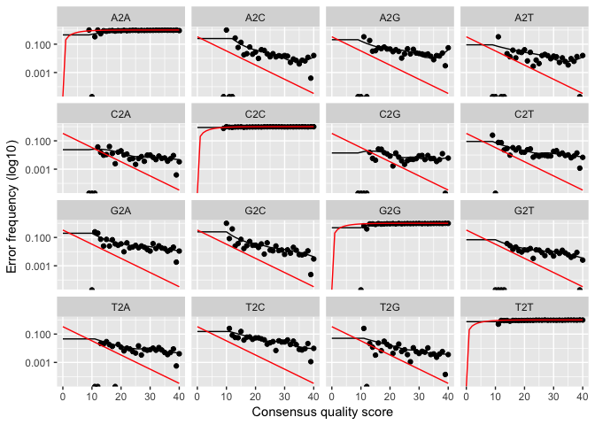

Analysis Report 1: Human Skin Microbiota Sexually Induced Differences
================
Katelyn Kukar
November 01, 2017

Introduction
============

Methodology to estimate microbial diversity has significantly increased with an effort to understand the distribution and diversity of microbes in their natural environments. Cultivation-dependent methodology work to mimic the natural environment of microbes in a laboratory setting, with enrichment cultures being particularly important for visualizing species that favor the selected media for growth (Nichols, 2007). Different ecological metrics have been used to categorize these cultivated colonies in order to deduce community data about known bacterial species and potentially deduce information about unknown species (Birtel *et al.*, 2015). Understanding the cultivation methodology to successfully grow microbial species lends information about the requirements imperative for bio diverse communities that can be beneficial in studying niche environments like the human gut which interact with pathogens and probiotics (Wu *et al.*, 2012). Beyond healthcare, general dispersal of bacterial communities increases biodiversity in water sources, soils, and all micro environments that effect the well being of the larger ecosystem, with this assumption also holding true for bacterial organisms which reside on a human host or human host environment (Fuhrman, 1999).

Within the paper, *Forensic identification using skin bacterial communities*, published in 2010 by Noah Fierer the diversity in human skin bacterial communities is explained to be “far higher than previously recognized, with a high degree of inter-individual variability in the composition of bacterial communities.” This discovery leads the paper to discuss that these individualized communities can be utilized as personal identifiers for criminal cases as forensic evidence. Fierer et al. specifically claims that “these skin bacteria may persist on touched surfaces for prolonged periods because many are highly resistant to environmental- mental stresses, including moisture, temperature, and UV radiation,” meaning the community samples can be collected long after the host has left (Fierer *et al.*, 2010). Though the implications for forensic research are still under scrutiny, the data can be more broadly analyzed to deduce if there are specific differences in bacterial communities between female and male participants. By analytically evaluating these communities separately to find patterns in abundance, richness, and diversity we deduce information about the specific community composition, which can yield information about the overall biodiversity of the niche the bacteria are a part of. The inference that human hosts hold their own unique sets of bacteria helps foster the notion of unique micro environments that endosymbiotically regulate the human body.

By explicitly looking at community differences between male and female participants, information can be gathered about the overall health and well-being of each participant sex in regard to the surrounding environment. In a study published in Science in 2013, it was discovered that the gut microbiota is extremely relevant in determining autoimmune disease susceptibility (Markle *et al.*, 2013). Markle et al. stated that when male cecal contents were transferred to female mice these mice received a higher level of protection against “pancreatic islet inflammation, autoantibody production, and the development of diabetes,” meaning this difference within the sexes microbiota was translational to inhibit the spread of disease (Markle *et al.*, 2013). Therefore, understanding the differences in the skin microbiota could also potentially pose interesting medical questions that could yield insight on diseases current to specific, sexually biased traits.

Overall, divulging community data analysis from female and male participants, from the sequenced data sets from the Fierer et. al paper, can provide useful information about the resident skin microbiota of sexually diverse humans. By using sex as the means of a comparison further hypotheses can be made that explain differences based on hormonal differences and social differences since the presiding environment remains constant for both sample sets. We can thereby infer that because of these differences a community the female and male sex of humans house a community of bacteria that are significantly different in regard to diversity, richness, and abundance on human hands. We test this hypothesis utilizing computational amplicon sequencing analyses that parse data particular to the bacterial communities found within the Fierer et al paper.

Methods
=======

Sample origin and sequencing
----------------------------

### Sample collection

All analysis was done using Fierer et al. as a reference source for sequence data and sample origins. Within the paper it is stated that samples were taken from nine healthy adults (four female, five male) who worked within the same building at the University of Colorado between ages 18-40. The samples taken included computer mouse swabs touched by the owner 12h before swabbing and the palm of the individual's dominant hand used to operate the mouse. Individuals were required to maintain normal hygiene habits prior to the swab as to not increase variation. The swabs were taken using autoclave cotton-tipped swabs that were autoclave and pre-moistened with a sterile solution. The swabbing took place for 10s per sample taken with all samples being kept at -80C for less than a week before DNA extraction (Fierer *et al.*, 2010).

### DNA and Pyrosequencing

Fierer et. al 2010 explains that for each sample the 16s rRNA genes were amplified using the MO BIO PowerSoil DNA Isolation kit with the broken, frozen cotton swabs. These tubes were then horizontally shaken and kit procedures were followed for extraction. PCR reactions were carried out in triplicate repeats using HotMAsterMic with thermal cycling at 94C for 3min followed by 35 cycles of denaturation, annealing for 30s, and extension and final extension procedures. Replicate amplicons were pooled in agarose gel using SYBR Safe DNA gel stain from Invitrogen. Amplicon DNA concentrations were then measured with the final pool of DNA being precipitated, centrifuged, and centrifuged to create a pellet that was re-suspended in nuclease-free water. Pyrosequencing was then carried out on a 454 Life Sciences Genome Sequencer FLX instrument at the University of South Carolina (Fierer *et al.*, 2010).

Computational
-------------

To create a meta data set with all of the vectors of interest we initially utilized the raw data sets collected from the 454 Sequencer and published by Fierer et al. This was done using a Dada pipeline within R. We ordered the samples first, then extracted the sample names from their fastq format, which was initially done using a remote server and fastq-dump to download the list of files in the run table to the raw directory. QC reports were then created for each of the runs utilizing fastqc and outputted as HTML to be readable. We then plotted the quality of each of the twenty samples of interest into a readable format in order to deduce the length to trim. It was found that quality is reduced after 200 bases, so the maximum acceptable length was made to be 225 bases. Using the dada pipeline the sequences were filtered, trimmed, into a new output folder and allowed to have 3 expected errors ((McMurdie and Holmes, 2013). A table of read counts was formatted to visualize the reads before and after filters and then again to visualize error trends. Duplicated sequences were then removed and dada was run on the reads based on 454 data recommendations. The sequences were aligned to craft a site by species matrix and a histogram representation of sequence lengths from all samples. Chimeras were removed and a singular table to give all pipeline information of the sequences trimmed and edited was created. A taxa code was initiated to yield a table with the taxonomy of each individual sequence to create a phylogeny that expresses the overall relatedness of each sequence. All of these tables were crafted in the dada pipeline through the sex of both male and female sample sets to visualize relatedness among all samples tested.

Once the data set was compiled by relatedness pyroseq organized all aspects of the data into a merged meta data set. This data set was parsed to remove any non-applicable data regarding the sex of participants (i.e. all samples which included swabs from electronic devices). The data was then melted to include all taxonomically related data sets that were coded for under the taxa file, separate from the metadata that was read in. This allowed for analysis via tables, figures, and ggplot graphs.

Dplyr and ggplot packages were used to analyze the data through representative figures and tables for the melted figure which was a compilation of the taxonomical data and pyrosequenced data. The pyrosequenced data set was also pruned in order to use pyroseq plot format on samples which include only males and females. The figures used look at abundance, richness, diversity metrics (applied through Shannon diversity), a phylogeny of the entire community set, and an ordination all of which are separated by the respective sex to divulge sex based community analysis on the bacterial species present.

Results
=======

Parsing Data
------------

To divulge significant evidence towards our hypothesis on the differences between sexually unique bacterial communities computational metrics were applied to the 2010 Fierer et al study in order to parse the data to uniquely address male and female samples alone.

The primary step for this analysis included analyzing the 454 sequenced samples to be trimmed in order to reduce errors and then compiled into an easy to read spreadsheet where sequence identifiers, sequence length, read errors, taxonomy, and sex-based sample type were listed for imperative analytic usage.

The primary graphs represent each of 20 samples original sequence error margins.

``` r
# Plots the quality profiles of all twenty samples
plotQualityProfile(filenames_forward_reads[1:20])
```


We can see from the quality profiles that most reads tend to get pretty bad in quality after around 200 bases. Therefore, we decided to set a maximum acceptable sequence length of 225 bases.

|                  |  Reads In|  Reads Out|
|------------------|---------:|----------:|
| ERR1942280.fastq |       404|        350|
| ERR1942281.fastq |       422|        194|
| ERR1942282.fastq |       412|         31|
| ERR1942283.fastq |       791|        426|
| ERR1942284.fastq |       677|        525|
| ERR1942285.fastq |       443|         72|
| ERR1942286.fastq |       667|        617|
| ERR1942287.fastq |       590|        541|
| ERR1942288.fastq |       908|        877|
| ERR1942289.fastq |       372|        147|
| ERR1942290.fastq |       468|        249|
| ERR1942291.fastq |       933|        819|
| ERR1942292.fastq |       724|        709|
| ERR1942293.fastq |       811|        470|
| ERR1942294.fastq |       938|        552|
| ERR1942295.fastq |       705|        620|
| ERR1942296.fastq |       754|        441|
| ERR1942297.fastq |       275|        246|
| ERR1942298.fastq |       562|        389|
| ERR1942299.fastq |      1025|        852|

    ## Not all sequences were the same length.
    ## Not all sequences were the same length.
    ## Not all sequences were the same length.
    ## Not all sequences were the same length.
    ## Not all sequences were the same length.
    ## Not all sequences were the same length.
    ## Not all sequences were the same length.
    ## Not all sequences were the same length.
    ## Not all sequences were the same length.
    ## Not all sequences were the same length.
    ## Not all sequences were the same length.
    ## Not all sequences were the same length.
    ## Not all sequences were the same length.
    ## Not all sequences were the same length.
    ## Not all sequences were the same length.
    ## Not all sequences were the same length.
    ## Not all sequences were the same length.
    ## Not all sequences were the same length.
    ## Not all sequences were the same length.
    ## Not all sequences were the same length.
    ## Initializing error rates to maximum possible estimate.
    ## Sample 1 - 350 reads in 72 unique sequences.
    ## Sample 2 - 194 reads in 163 unique sequences.
    ## Sample 3 - 31 reads in 25 unique sequences.
    ## Sample 4 - 426 reads in 176 unique sequences.
    ## Sample 5 - 525 reads in 134 unique sequences.
    ## Sample 6 - 72 reads in 65 unique sequences.
    ## Sample 7 - 617 reads in 178 unique sequences.
    ## Sample 8 - 541 reads in 135 unique sequences.
    ## Sample 9 - 877 reads in 201 unique sequences.
    ## Sample 10 - 147 reads in 107 unique sequences.
    ## Sample 11 - 249 reads in 181 unique sequences.
    ## Sample 12 - 819 reads in 212 unique sequences.
    ## Sample 13 - 709 reads in 128 unique sequences.
    ## Sample 14 - 470 reads in 171 unique sequences.
    ## Sample 15 - 552 reads in 250 unique sequences.
    ## Sample 16 - 620 reads in 141 unique sequences.
    ## Sample 17 - 441 reads in 186 unique sequences.
    ## Sample 18 - 246 reads in 88 unique sequences.
    ## Sample 19 - 389 reads in 332 unique sequences.
    ## Sample 20 - 852 reads in 239 unique sequences.
    ##    selfConsist step 2 
    ##    selfConsist step 3 
    ## 
    ## 
    ## Convergence after  3  rounds.
    ## Total reads used:  9127

This table and corresponding error models were built to showcase the read errors from the sequencing data and the corresponding trimming profile and alignment that needed to be accounted for to allow for reproducible and unbiased analysis (removing repeats, trimming, accounting for error bias, and chimeric regions with all sequences being parsed with 454 acceptable protocols through a dada pipeline).

``` r
# quick check to see if error models match data
# (black lines match black points) and are generally decresing left to right
 plotErrors(errors_forward_reads,
           nominalQ = TRUE)
```

    ## Warning: Transformation introduced infinite values in continuous y-axis

    ## Warning: Transformation introduced infinite values in continuous y-axis



    ## Dereplicating sequence entries in Fastq file: output/filtered/ERR1942280_filt.fastq.gz

    ## Encountered 72 unique sequences from 350 total sequences read.

    ## Not all sequences were the same length.

    ## Dereplicating sequence entries in Fastq file: output/filtered/ERR1942281_filt.fastq.gz

    ## Encountered 163 unique sequences from 194 total sequences read.

    ## Not all sequences were the same length.

    ## Dereplicating sequence entries in Fastq file: output/filtered/ERR1942282_filt.fastq.gz

    ## Encountered 25 unique sequences from 31 total sequences read.

    ## Not all sequences were the same length.

    ## Dereplicating sequence entries in Fastq file: output/filtered/ERR1942283_filt.fastq.gz

    ## Encountered 176 unique sequences from 426 total sequences read.

    ## Not all sequences were the same length.

    ## Dereplicating sequence entries in Fastq file: output/filtered/ERR1942284_filt.fastq.gz

    ## Encountered 134 unique sequences from 525 total sequences read.

    ## Not all sequences were the same length.

    ## Dereplicating sequence entries in Fastq file: output/filtered/ERR1942285_filt.fastq.gz

    ## Encountered 65 unique sequences from 72 total sequences read.

    ## Not all sequences were the same length.

    ## Dereplicating sequence entries in Fastq file: output/filtered/ERR1942286_filt.fastq.gz

    ## Encountered 178 unique sequences from 617 total sequences read.

    ## Not all sequences were the same length.

    ## Dereplicating sequence entries in Fastq file: output/filtered/ERR1942287_filt.fastq.gz

    ## Encountered 135 unique sequences from 541 total sequences read.

    ## Not all sequences were the same length.

    ## Dereplicating sequence entries in Fastq file: output/filtered/ERR1942288_filt.fastq.gz

    ## Encountered 201 unique sequences from 877 total sequences read.

    ## Not all sequences were the same length.

    ## Dereplicating sequence entries in Fastq file: output/filtered/ERR1942289_filt.fastq.gz

    ## Encountered 107 unique sequences from 147 total sequences read.

    ## Not all sequences were the same length.

    ## Dereplicating sequence entries in Fastq file: output/filtered/ERR1942290_filt.fastq.gz

    ## Encountered 181 unique sequences from 249 total sequences read.

    ## Not all sequences were the same length.

    ## Dereplicating sequence entries in Fastq file: output/filtered/ERR1942291_filt.fastq.gz

    ## Encountered 212 unique sequences from 819 total sequences read.

    ## Not all sequences were the same length.

    ## Dereplicating sequence entries in Fastq file: output/filtered/ERR1942292_filt.fastq.gz

    ## Encountered 128 unique sequences from 709 total sequences read.

    ## Not all sequences were the same length.

    ## Dereplicating sequence entries in Fastq file: output/filtered/ERR1942293_filt.fastq.gz

    ## Encountered 171 unique sequences from 470 total sequences read.

    ## Not all sequences were the same length.

    ## Dereplicating sequence entries in Fastq file: output/filtered/ERR1942294_filt.fastq.gz

    ## Encountered 250 unique sequences from 552 total sequences read.

    ## Not all sequences were the same length.

    ## Dereplicating sequence entries in Fastq file: output/filtered/ERR1942295_filt.fastq.gz

    ## Encountered 141 unique sequences from 620 total sequences read.

    ## Not all sequences were the same length.

    ## Dereplicating sequence entries in Fastq file: output/filtered/ERR1942296_filt.fastq.gz

    ## Encountered 186 unique sequences from 441 total sequences read.

    ## Not all sequences were the same length.

    ## Dereplicating sequence entries in Fastq file: output/filtered/ERR1942297_filt.fastq.gz

    ## Encountered 88 unique sequences from 246 total sequences read.

    ## Not all sequences were the same length.

    ## Dereplicating sequence entries in Fastq file: output/filtered/ERR1942298_filt.fastq.gz

    ## Encountered 332 unique sequences from 389 total sequences read.

    ## Not all sequences were the same length.

    ## Dereplicating sequence entries in Fastq file: output/filtered/ERR1942299_filt.fastq.gz

    ## Encountered 239 unique sequences from 852 total sequences read.

    ## Not all sequences were the same length.

    ## Sample 1 - 350 reads in 72 unique sequences.
    ## Sample 2 - 194 reads in 163 unique sequences.
    ## Sample 3 - 31 reads in 25 unique sequences.
    ## Sample 4 - 426 reads in 176 unique sequences.
    ## Sample 5 - 525 reads in 134 unique sequences.
    ## Sample 6 - 72 reads in 65 unique sequences.
    ## Sample 7 - 617 reads in 178 unique sequences.
    ## Sample 8 - 541 reads in 135 unique sequences.
    ## Sample 9 - 877 reads in 201 unique sequences.
    ## Sample 10 - 147 reads in 107 unique sequences.
    ## Sample 11 - 249 reads in 181 unique sequences.
    ## Sample 12 - 819 reads in 212 unique sequences.
    ## Sample 13 - 709 reads in 128 unique sequences.
    ## Sample 14 - 470 reads in 171 unique sequences.
    ## Sample 15 - 552 reads in 250 unique sequences.
    ## Sample 16 - 620 reads in 141 unique sequences.
    ## Sample 17 - 441 reads in 186 unique sequences.
    ## Sample 18 - 246 reads in 88 unique sequences.
    ## Sample 19 - 389 reads in 332 unique sequences.
    ## Sample 20 - 852 reads in 239 unique sequences.

    ## $ERR1942280
    ## dada-class: object describing DADA2 denoising results
    ## 3 sample sequences were inferred from 72 input unique sequences.
    ## Key parameters: OMEGA_A = 1e-40, BAND_SIZE = 32, USE_QUALS = TRUE
    ## 
    ## $ERR1942281
    ## dada-class: object describing DADA2 denoising results
    ## 18 sample sequences were inferred from 163 input unique sequences.
    ## Key parameters: OMEGA_A = 1e-40, BAND_SIZE = 32, USE_QUALS = TRUE
    ## 
    ## $ERR1942282
    ## dada-class: object describing DADA2 denoising results
    ## 3 sample sequences were inferred from 25 input unique sequences.
    ## Key parameters: OMEGA_A = 1e-40, BAND_SIZE = 32, USE_QUALS = TRUE
    ## 
    ## $ERR1942283
    ## dada-class: object describing DADA2 denoising results
    ## 17 sample sequences were inferred from 176 input unique sequences.
    ## Key parameters: OMEGA_A = 1e-40, BAND_SIZE = 32, USE_QUALS = TRUE
    ## 
    ## $ERR1942284
    ## dada-class: object describing DADA2 denoising results
    ## 4 sample sequences were inferred from 134 input unique sequences.
    ## Key parameters: OMEGA_A = 1e-40, BAND_SIZE = 32, USE_QUALS = TRUE
    ## 
    ## $ERR1942285
    ## dada-class: object describing DADA2 denoising results
    ## 7 sample sequences were inferred from 65 input unique sequences.
    ## Key parameters: OMEGA_A = 1e-40, BAND_SIZE = 32, USE_QUALS = TRUE
    ## 
    ## $ERR1942286
    ## dada-class: object describing DADA2 denoising results
    ## 8 sample sequences were inferred from 178 input unique sequences.
    ## Key parameters: OMEGA_A = 1e-40, BAND_SIZE = 32, USE_QUALS = TRUE
    ## 
    ## $ERR1942287
    ## dada-class: object describing DADA2 denoising results
    ## 5 sample sequences were inferred from 135 input unique sequences.
    ## Key parameters: OMEGA_A = 1e-40, BAND_SIZE = 32, USE_QUALS = TRUE
    ## 
    ## $ERR1942288
    ## dada-class: object describing DADA2 denoising results
    ## 5 sample sequences were inferred from 201 input unique sequences.
    ## Key parameters: OMEGA_A = 1e-40, BAND_SIZE = 32, USE_QUALS = TRUE
    ## 
    ## $ERR1942289
    ## dada-class: object describing DADA2 denoising results
    ## 17 sample sequences were inferred from 107 input unique sequences.
    ## Key parameters: OMEGA_A = 1e-40, BAND_SIZE = 32, USE_QUALS = TRUE
    ## 
    ## $ERR1942290
    ## dada-class: object describing DADA2 denoising results
    ## 13 sample sequences were inferred from 181 input unique sequences.
    ## Key parameters: OMEGA_A = 1e-40, BAND_SIZE = 32, USE_QUALS = TRUE
    ## 
    ## $ERR1942291
    ## dada-class: object describing DADA2 denoising results
    ## 8 sample sequences were inferred from 212 input unique sequences.
    ## Key parameters: OMEGA_A = 1e-40, BAND_SIZE = 32, USE_QUALS = TRUE
    ## 
    ## $ERR1942292
    ## dada-class: object describing DADA2 denoising results
    ## 3 sample sequences were inferred from 128 input unique sequences.
    ## Key parameters: OMEGA_A = 1e-40, BAND_SIZE = 32, USE_QUALS = TRUE
    ## 
    ## $ERR1942293
    ## dada-class: object describing DADA2 denoising results
    ## 11 sample sequences were inferred from 171 input unique sequences.
    ## Key parameters: OMEGA_A = 1e-40, BAND_SIZE = 32, USE_QUALS = TRUE
    ## 
    ## $ERR1942294
    ## dada-class: object describing DADA2 denoising results
    ## 30 sample sequences were inferred from 250 input unique sequences.
    ## Key parameters: OMEGA_A = 1e-40, BAND_SIZE = 32, USE_QUALS = TRUE
    ## 
    ## $ERR1942295
    ## dada-class: object describing DADA2 denoising results
    ## 4 sample sequences were inferred from 141 input unique sequences.
    ## Key parameters: OMEGA_A = 1e-40, BAND_SIZE = 32, USE_QUALS = TRUE
    ## 
    ## $ERR1942296
    ## dada-class: object describing DADA2 denoising results
    ## 17 sample sequences were inferred from 186 input unique sequences.
    ## Key parameters: OMEGA_A = 1e-40, BAND_SIZE = 32, USE_QUALS = TRUE
    ## 
    ## $ERR1942297
    ## dada-class: object describing DADA2 denoising results
    ## 5 sample sequences were inferred from 88 input unique sequences.
    ## Key parameters: OMEGA_A = 1e-40, BAND_SIZE = 32, USE_QUALS = TRUE
    ## 
    ## $ERR1942298
    ## dada-class: object describing DADA2 denoising results
    ## 21 sample sequences were inferred from 332 input unique sequences.
    ## Key parameters: OMEGA_A = 1e-40, BAND_SIZE = 32, USE_QUALS = TRUE
    ## 
    ## $ERR1942299
    ## dada-class: object describing DADA2 denoising results
    ## 8 sample sequences were inferred from 239 input unique sequences.
    ## Key parameters: OMEGA_A = 1e-40, BAND_SIZE = 32, USE_QUALS = TRUE

    ## The sequences being tabled vary in length.

**Figure 1**: Sequence Length Histogram 

This table explicitly represents the sequence lengths of the trimmed data set to show they are all correctly analyzed beneath the given range of 225 bases.

    ## Identified 2 bimeras out of 178 input sequences.

After removing chimeras, we were left with 99.65% of our cleaned reads.

|            |  Input|  Filtered|  Denoised|  Sequence Table|  Non-chimeric|
|------------|------:|---------:|---------:|---------------:|-------------:|
| ERR1942280 |    404|       350|       350|             350|           350|
| ERR1942281 |    422|       194|       194|             194|           194|
| ERR1942282 |    412|        31|        31|              31|            31|
| ERR1942283 |    791|       426|       426|             426|           426|
| ERR1942284 |    677|       525|       525|             525|           525|
| ERR1942285 |    443|        72|        72|              72|            72|
| ERR1942286 |    667|       617|       617|             617|           585|
| ERR1942287 |    590|       541|       541|             541|           541|
| ERR1942288 |    908|       877|       877|             877|           877|
| ERR1942289 |    372|       147|       147|             147|           147|
| ERR1942290 |    468|       249|       249|             249|           249|
| ERR1942291 |    933|       819|       819|             819|           819|
| ERR1942292 |    724|       709|       709|             709|           709|
| ERR1942293 |    811|       470|       470|             470|           470|
| ERR1942294 |    938|       552|       552|             552|           552|
| ERR1942295 |    705|       620|       620|             620|           620|
| ERR1942296 |    754|       441|       441|             441|           441|
| ERR1942297 |    275|       246|       246|             246|           246|
| ERR1942298 |    562|       389|       389|             389|           389|
| ERR1942299 |   1025|       852|       852|             852|           852|

This markdown table showcases the edited data and the reads given out after each step of filtering for the corrected data set to be used in figure based computational analysis.

    ##        [,1]       [,2]                        [,3]                 
    ##   [1,] "Bacteria" "Proteobacteria"            NA                   
    ##   [2,] "Bacteria" "Proteobacteria"            "Alphaproteobacteria"
    ##   [3,] "Bacteria" "Bacteroidetes"             NA                   
    ##   [4,] "Bacteria" "Proteobacteria"            NA                   
    ##   [5,] "Bacteria" "Proteobacteria"            "Betaproteobacteria" 
    ##   [6,] "Bacteria" "Cyanobacteria/Chloroplast" "Chloroplast"        
    ##   [7,] "Bacteria" "Proteobacteria"            "Betaproteobacteria" 
    ##   [8,] "Bacteria" "Bacteroidetes"             NA                   
    ##   [9,] "Bacteria" "Proteobacteria"            "Alphaproteobacteria"
    ##  [10,] "Bacteria" "Proteobacteria"            "Betaproteobacteria" 
    ##  [11,] "Bacteria" "Proteobacteria"            NA                   
    ##  [12,] "Bacteria" "Actinobacteria"            "Actinobacteria"     
    ##  [13,] "Bacteria" "Cyanobacteria/Chloroplast" "Chloroplast"        
    ##  [14,] "Bacteria" "Proteobacteria"            "Betaproteobacteria" 
    ##  [15,] "Bacteria" "Proteobacteria"            "Betaproteobacteria" 
    ##  [16,] "Bacteria" "Proteobacteria"            NA                   
    ##  [17,] "Bacteria" "Bacteroidetes"             "Flavobacteriia"     
    ##  [18,] "Bacteria" "Firmicutes"                "Clostridia"         
    ##  [19,] "Bacteria" NA                          NA                   
    ##  [20,] "Bacteria" "Proteobacteria"            "Betaproteobacteria" 
    ##  [21,] "Bacteria" "Firmicutes"                "Clostridia"         
    ##  [22,] "Bacteria" "Firmicutes"                "Clostridia"         
    ##  [23,] "Bacteria" "Firmicutes"                "Clostridia"         
    ##  [24,] "Bacteria" "Firmicutes"                "Clostridia"         
    ##  [25,] "Bacteria" "Proteobacteria"            "Betaproteobacteria" 
    ##  [26,] "Bacteria" "Cyanobacteria/Chloroplast" "Chloroplast"        
    ##  [27,] "Bacteria" "Firmicutes"                "Clostridia"         
    ##  [28,] "Bacteria" "Actinobacteria"            "Actinobacteria"     
    ##  [29,] "Bacteria" "Firmicutes"                "Clostridia"         
    ##  [30,] "Bacteria" "Proteobacteria"            "Alphaproteobacteria"
    ##  [31,] "Bacteria" "Actinobacteria"            "Actinobacteria"     
    ##  [32,] "Bacteria" "Actinobacteria"            "Actinobacteria"     
    ##  [33,] "Bacteria" "Actinobacteria"            "Actinobacteria"     
    ##  [34,] "Bacteria" "Actinobacteria"            "Actinobacteria"     
    ##  [35,] "Bacteria" "Firmicutes"                "Clostridia"         
    ##  [36,] "Bacteria" "Proteobacteria"            "Betaproteobacteria" 
    ##  [37,] "Bacteria" "Proteobacteria"            "Alphaproteobacteria"
    ##  [38,] "Bacteria" "Actinobacteria"            "Actinobacteria"     
    ##  [39,] "Bacteria" "Cyanobacteria/Chloroplast" "Chloroplast"        
    ##  [40,] "Bacteria" "Bacteroidetes"             "Flavobacteriia"     
    ##  [41,] "Bacteria" "Firmicutes"                "Bacilli"            
    ##  [42,] "Bacteria" "Firmicutes"                "Clostridia"         
    ##  [43,] "Bacteria" "Proteobacteria"            "Betaproteobacteria" 
    ##  [44,] "Bacteria" "Firmicutes"                "Clostridia"         
    ##  [45,] "Bacteria" "Proteobacteria"            "Gammaproteobacteria"
    ##  [46,] "Bacteria" "Actinobacteria"            "Actinobacteria"     
    ##  [47,] "Bacteria" "Firmicutes"                "Clostridia"         
    ##  [48,] "Bacteria" "Proteobacteria"            "Betaproteobacteria" 
    ##  [49,] "Bacteria" "Actinobacteria"            "Actinobacteria"     
    ##  [50,] "Bacteria" "Actinobacteria"            "Actinobacteria"     
    ##  [51,] "Bacteria" "Actinobacteria"            "Actinobacteria"     
    ##  [52,] "Bacteria" "Firmicutes"                "Clostridia"         
    ##  [53,] "Bacteria" "Actinobacteria"            "Actinobacteria"     
    ##  [54,] "Bacteria" "Proteobacteria"            "Alphaproteobacteria"
    ##  [55,] "Bacteria" "Firmicutes"                NA                   
    ##  [56,] "Bacteria" "Actinobacteria"            "Actinobacteria"     
    ##  [57,] "Bacteria" "Firmicutes"                "Clostridia"         
    ##  [58,] "Bacteria" "Proteobacteria"            "Gammaproteobacteria"
    ##  [59,] "Bacteria" "Proteobacteria"            NA                   
    ##  [60,] "Bacteria" "Firmicutes"                "Clostridia"         
    ##  [61,] "Bacteria" "Firmicutes"                "Clostridia"         
    ##  [62,] "Bacteria" "Proteobacteria"            "Alphaproteobacteria"
    ##  [63,] "Bacteria" "Firmicutes"                NA                   
    ##  [64,] "Bacteria" "Actinobacteria"            "Actinobacteria"     
    ##  [65,] "Bacteria" "Actinobacteria"            "Actinobacteria"     
    ##  [66,] "Bacteria" "Actinobacteria"            "Actinobacteria"     
    ##  [67,] "Bacteria" "Proteobacteria"            "Alphaproteobacteria"
    ##  [68,] "Bacteria" "Firmicutes"                "Clostridia"         
    ##  [69,] "Bacteria" "Firmicutes"                "Clostridia"         
    ##  [70,] "Bacteria" "Proteobacteria"            "Alphaproteobacteria"
    ##  [71,] "Bacteria" "Firmicutes"                "Clostridia"         
    ##  [72,] "Bacteria" "Proteobacteria"            "Betaproteobacteria" 
    ##  [73,] "Bacteria" "Firmicutes"                "Clostridia"         
    ##  [74,] "Bacteria" "Actinobacteria"            "Actinobacteria"     
    ##  [75,] "Bacteria" "Cyanobacteria/Chloroplast" "Chloroplast"        
    ##  [76,] "Bacteria" "Firmicutes"                "Clostridia"         
    ##  [77,] "Bacteria" "Actinobacteria"            "Actinobacteria"     
    ##  [78,] "Bacteria" "Actinobacteria"            "Actinobacteria"     
    ##  [79,] "Bacteria" "Actinobacteria"            "Actinobacteria"     
    ##  [80,] "Bacteria" "Firmicutes"                "Clostridia"         
    ##  [81,] "Bacteria" "Bacteroidetes"             "Flavobacteriia"     
    ##  [82,] "Bacteria" "Actinobacteria"            "Actinobacteria"     
    ##  [83,] "Bacteria" "Proteobacteria"            "Alphaproteobacteria"
    ##  [84,] "Bacteria" "Firmicutes"                "Clostridia"         
    ##  [85,] "Bacteria" "Proteobacteria"            "Betaproteobacteria" 
    ##  [86,] "Bacteria" "Proteobacteria"            "Alphaproteobacteria"
    ##  [87,] "Bacteria" "Cyanobacteria/Chloroplast" "Chloroplast"        
    ##  [88,] "Bacteria" "Firmicutes"                "Clostridia"         
    ##  [89,] "Bacteria" "Proteobacteria"            "Gammaproteobacteria"
    ##  [90,] "Bacteria" "Proteobacteria"            "Betaproteobacteria" 
    ##  [91,] "Bacteria" "Gemmatimonadetes"          "Gemmatimonadetes"   
    ##  [92,] "Bacteria" "Actinobacteria"            "Actinobacteria"     
    ##  [93,] "Bacteria" "Proteobacteria"            "Betaproteobacteria" 
    ##  [94,] "Bacteria" "Firmicutes"                "Bacilli"            
    ##  [95,] "Bacteria" "Firmicutes"                "Clostridia"         
    ##  [96,] "Bacteria" "Actinobacteria"            "Actinobacteria"     
    ##  [97,] "Bacteria" "Proteobacteria"            NA                   
    ##  [98,] "Bacteria" "Actinobacteria"            "Actinobacteria"     
    ##  [99,] "Bacteria" "Actinobacteria"            "Actinobacteria"     
    ## [100,] "Bacteria" "Firmicutes"                "Clostridia"         
    ## [101,] "Bacteria" "Firmicutes"                "Clostridia"         
    ## [102,] "Bacteria" "Firmicutes"                "Clostridia"         
    ## [103,] "Bacteria" "Firmicutes"                "Clostridia"         
    ## [104,] "Bacteria" "Actinobacteria"            "Actinobacteria"     
    ## [105,] "Bacteria" "Firmicutes"                "Clostridia"         
    ## [106,] "Bacteria" NA                          NA                   
    ## [107,] "Bacteria" "Firmicutes"                "Clostridia"         
    ## [108,] "Bacteria" "Bacteroidetes"             "Sphingobacteriia"   
    ## [109,] "Bacteria" "Firmicutes"                "Bacilli"            
    ## [110,] "Bacteria" "Gemmatimonadetes"          "Gemmatimonadetes"   
    ## [111,] "Bacteria" "Actinobacteria"            "Actinobacteria"     
    ## [112,] "Bacteria" "Firmicutes"                "Bacilli"            
    ## [113,] "Bacteria" "Bacteroidetes"             "Sphingobacteriia"   
    ## [114,] "Bacteria" "Firmicutes"                "Clostridia"         
    ## [115,] "Bacteria" "Firmicutes"                "Clostridia"         
    ## [116,] "Bacteria" "Firmicutes"                "Clostridia"         
    ## [117,] "Bacteria" "Actinobacteria"            "Actinobacteria"     
    ## [118,] "Bacteria" "Proteobacteria"            "Alphaproteobacteria"
    ## [119,] "Bacteria" "Firmicutes"                "Clostridia"         
    ## [120,] "Bacteria" "Firmicutes"                "Clostridia"         
    ## [121,] "Bacteria" "Proteobacteria"            "Alphaproteobacteria"
    ## [122,] "Bacteria" "Firmicutes"                "Clostridia"         
    ## [123,] "Bacteria" "Actinobacteria"            "Actinobacteria"     
    ## [124,] "Bacteria" "Firmicutes"                "Bacilli"            
    ## [125,] "Bacteria" "Firmicutes"                "Clostridia"         
    ## [126,] "Bacteria" "Firmicutes"                "Bacilli"            
    ## [127,] "Bacteria" "Firmicutes"                "Clostridia"         
    ## [128,] "Bacteria" "Proteobacteria"            "Alphaproteobacteria"
    ## [129,] "Bacteria" "Proteobacteria"            "Alphaproteobacteria"
    ## [130,] "Bacteria" "Spirochaetes"              "Spirochaetia"       
    ## [131,] "Bacteria" "Firmicutes"                "Clostridia"         
    ## [132,] "Bacteria" NA                          NA                   
    ## [133,] "Bacteria" "Firmicutes"                NA                   
    ## [134,] "Bacteria" "Proteobacteria"            "Gammaproteobacteria"
    ## [135,] "Bacteria" "Firmicutes"                "Clostridia"         
    ## [136,] "Bacteria" "Proteobacteria"            "Alphaproteobacteria"
    ## [137,] "Bacteria" "Proteobacteria"            "Alphaproteobacteria"
    ## [138,] "Bacteria" "Firmicutes"                "Clostridia"         
    ## [139,] "Bacteria" "Proteobacteria"            "Betaproteobacteria" 
    ## [140,] "Bacteria" "Firmicutes"                "Erysipelotrichia"   
    ## [141,] "Bacteria" "Actinobacteria"            "Actinobacteria"     
    ## [142,] "Bacteria" "Actinobacteria"            "Actinobacteria"     
    ## [143,] "Bacteria" "Firmicutes"                "Clostridia"         
    ## [144,] "Bacteria" "Actinobacteria"            "Actinobacteria"     
    ## [145,] "Bacteria" "Firmicutes"                "Clostridia"         
    ## [146,] "Bacteria" "Actinobacteria"            "Actinobacteria"     
    ## [147,] "Bacteria" "Firmicutes"                "Clostridia"         
    ## [148,] "Bacteria" "Bacteroidetes"             "Sphingobacteriia"   
    ## [149,] "Bacteria" "Firmicutes"                "Clostridia"         
    ## [150,] "Bacteria" "Proteobacteria"            "Alphaproteobacteria"
    ## [151,] "Bacteria" "Actinobacteria"            "Actinobacteria"     
    ## [152,] "Bacteria" "Firmicutes"                "Clostridia"         
    ## [153,] "Bacteria" "Bacteroidetes"             "Bacteroidia"        
    ## [154,] "Bacteria" NA                          NA                   
    ## [155,] "Bacteria" "Proteobacteria"            NA                   
    ## [156,] "Bacteria" "Firmicutes"                "Clostridia"         
    ## [157,] "Bacteria" "Firmicutes"                "Clostridia"         
    ## [158,] "Bacteria" "Firmicutes"                "Clostridia"         
    ## [159,] "Bacteria" "Firmicutes"                "Bacilli"            
    ## [160,] "Bacteria" "Bacteroidetes"             "Flavobacteriia"     
    ## [161,] "Bacteria" "Fusobacteria"              "Fusobacteriia"      
    ## [162,] "Bacteria" "Firmicutes"                "Clostridia"         
    ## [163,] "Bacteria" "Firmicutes"                "Bacilli"            
    ## [164,] "Bacteria" "Firmicutes"                "Clostridia"         
    ## [165,] "Bacteria" "Nitrospirae"               "Nitrospira"         
    ## [166,] "Bacteria" "Parcubacteria"             NA                   
    ## [167,] "Bacteria" "Firmicutes"                "Bacilli"            
    ## [168,] "Bacteria" "Proteobacteria"            "Betaproteobacteria" 
    ## [169,] "Bacteria" "Bacteroidetes"             "Sphingobacteriia"   
    ## [170,] "Bacteria" "Actinobacteria"            "Actinobacteria"     
    ## [171,] "Bacteria" "Proteobacteria"            "Alphaproteobacteria"
    ## [172,] "Bacteria" "Firmicutes"                "Clostridia"         
    ## [173,] "Bacteria" "Firmicutes"                "Clostridia"         
    ## [174,] "Bacteria" "Actinobacteria"            "Actinobacteria"     
    ## [175,] "Bacteria" "Proteobacteria"            "Gammaproteobacteria"
    ## [176,] "Bacteria" "Actinobacteria"            "Actinobacteria"     
    ##        [,4]                 [,5]                  
    ##   [1,] NA                   NA                    
    ##   [2,] "Rhizobiales"        "Bartonellaceae"      
    ##   [3,] NA                   NA                    
    ##   [4,] NA                   NA                    
    ##   [5,] "Neisseriales"       "Neisseriaceae"       
    ##   [6,] "Chloroplast"        "Streptophyta"        
    ##   [7,] "Burkholderiales"    "Comamonadaceae"      
    ##   [8,] NA                   NA                    
    ##   [9,] "Rhizobiales"        "Bartonellaceae"      
    ##  [10,] "Burkholderiales"    "Oxalobacteraceae"    
    ##  [11,] NA                   NA                    
    ##  [12,] "Actinomycetales"    "Nocardiaceae"        
    ##  [13,] "Chloroplast"        "Streptophyta"        
    ##  [14,] "Burkholderiales"    "Oxalobacteraceae"    
    ##  [15,] "Neisseriales"       "Neisseriaceae"       
    ##  [16,] NA                   NA                    
    ##  [17,] "Flavobacteriales"   "Flavobacteriaceae"   
    ##  [18,] "Clostridiales"      "Lachnospiraceae"     
    ##  [19,] NA                   NA                    
    ##  [20,] "Burkholderiales"    "Comamonadaceae"      
    ##  [21,] "Clostridiales"      "Ruminococcaceae"     
    ##  [22,] "Clostridiales"      "Ruminococcaceae"     
    ##  [23,] "Clostridiales"      "Ruminococcaceae"     
    ##  [24,] "Clostridiales"      "Lachnospiraceae"     
    ##  [25,] "Burkholderiales"    "Comamonadaceae"      
    ##  [26,] "Chloroplast"        "Streptophyta"        
    ##  [27,] "Clostridiales"      "Ruminococcaceae"     
    ##  [28,] "Actinomycetales"    "Streptomycetaceae"   
    ##  [29,] "Clostridiales"      "Ruminococcaceae"     
    ##  [30,] "Sphingomonadales"   "Sphingomonadaceae"   
    ##  [31,] "Actinomycetales"    "Nocardioidaceae"     
    ##  [32,] "Actinomycetales"    "Streptomycetaceae"   
    ##  [33,] "Actinomycetales"    "Microbacteriaceae"   
    ##  [34,] "Actinomycetales"    "Streptomycetaceae"   
    ##  [35,] "Clostridiales"      "Ruminococcaceae"     
    ##  [36,] "Methylophilales"    "Methylophilaceae"    
    ##  [37,] "Sphingomonadales"   "Sphingomonadaceae"   
    ##  [38,] "Actinomycetales"    "Intrasporangiaceae"  
    ##  [39,] "Chloroplast"        "Streptophyta"        
    ##  [40,] "Flavobacteriales"   "Flavobacteriaceae"   
    ##  [41,] "Lactobacillales"    "Streptococcaceae"    
    ##  [42,] "Clostridiales"      "Ruminococcaceae"     
    ##  [43,] "Rhodocyclales"      "Rhodocyclaceae"      
    ##  [44,] "Clostridiales"      "Ruminococcaceae"     
    ##  [45,] "Pseudomonadales"    "Pseudomonadaceae"    
    ##  [46,] "Actinomycetales"    "Streptomycetaceae"   
    ##  [47,] "Clostridiales"      "Lachnospiraceae"     
    ##  [48,] "Burkholderiales"    "Comamonadaceae"      
    ##  [49,] "Actinomycetales"    "Microbacteriaceae"   
    ##  [50,] "Actinomycetales"    "Mycobacteriaceae"    
    ##  [51,] "Actinomycetales"    "Nocardioidaceae"     
    ##  [52,] "Clostridiales"      "Lachnospiraceae"     
    ##  [53,] "Actinomycetales"    "Streptomycetaceae"   
    ##  [54,] "Sphingomonadales"   "Sphingomonadaceae"   
    ##  [55,] NA                   NA                    
    ##  [56,] "Actinomycetales"    NA                    
    ##  [57,] "Clostridiales"      "Ruminococcaceae"     
    ##  [58,] "Pseudomonadales"    "Moraxellaceae"       
    ##  [59,] NA                   NA                    
    ##  [60,] "Clostridiales"      "Ruminococcaceae"     
    ##  [61,] "Clostridiales"      "Ruminococcaceae"     
    ##  [62,] "Rhizobiales"        "Methylobacteriaceae" 
    ##  [63,] NA                   NA                    
    ##  [64,] "Actinomycetales"    "Micrococcaceae"      
    ##  [65,] "Actinomycetales"    "Nocardioidaceae"     
    ##  [66,] "Actinomycetales"    "Microbacteriaceae"   
    ##  [67,] "Sphingomonadales"   "Sphingomonadaceae"   
    ##  [68,] "Clostridiales"      "Ruminococcaceae"     
    ##  [69,] "Clostridiales"      "Lachnospiraceae"     
    ##  [70,] "Rhizobiales"        "Methylobacteriaceae" 
    ##  [71,] "Clostridiales"      "Clostridiaceae_1"    
    ##  [72,] "Burkholderiales"    "Oxalobacteraceae"    
    ##  [73,] "Clostridiales"      "Lachnospiraceae"     
    ##  [74,] "Actinomycetales"    "Nocardioidaceae"     
    ##  [75,] "Chloroplast"        "Streptophyta"        
    ##  [76,] "Clostridiales"      "Ruminococcaceae"     
    ##  [77,] "Actinomycetales"    "Nocardiaceae"        
    ##  [78,] "Actinomycetales"    "Nocardioidaceae"     
    ##  [79,] "Actinomycetales"    "Microbacteriaceae"   
    ##  [80,] "Clostridiales"      "Ruminococcaceae"     
    ##  [81,] "Flavobacteriales"   "Flavobacteriaceae"   
    ##  [82,] "Actinomycetales"    "Microbacteriaceae"   
    ##  [83,] "Sphingomonadales"   "Sphingomonadaceae"   
    ##  [84,] "Clostridiales"      "Ruminococcaceae"     
    ##  [85,] "Burkholderiales"    "Oxalobacteraceae"    
    ##  [86,] "Rhizobiales"        "Bartonellaceae"      
    ##  [87,] "Chloroplast"        "Streptophyta"        
    ##  [88,] "Clostridiales"      "Ruminococcaceae"     
    ##  [89,] "Pseudomonadales"    "Pseudomonadaceae"    
    ##  [90,] "Rhodocyclales"      "Rhodocyclaceae"      
    ##  [91,] "Gemmatimonadales"   "Gemmatimonadaceae"   
    ##  [92,] "Actinomycetales"    "Nocardioidaceae"     
    ##  [93,] "Burkholderiales"    "Oxalobacteraceae"    
    ##  [94,] "Lactobacillales"    "Streptococcaceae"    
    ##  [95,] "Clostridiales"      NA                    
    ##  [96,] "Actinomycetales"    "Propionibacteriaceae"
    ##  [97,] NA                   NA                    
    ##  [98,] "Actinomycetales"    "Streptomycetaceae"   
    ##  [99,] "Actinomycetales"    "Intrasporangiaceae"  
    ## [100,] "Clostridiales"      "Lachnospiraceae"     
    ## [101,] "Clostridiales"      NA                    
    ## [102,] "Clostridiales"      "Ruminococcaceae"     
    ## [103,] "Clostridiales"      "Lachnospiraceae"     
    ## [104,] "Actinomycetales"    "Nocardioidaceae"     
    ## [105,] "Clostridiales"      "Lachnospiraceae"     
    ## [106,] NA                   NA                    
    ## [107,] "Clostridiales"      "Lachnospiraceae"     
    ## [108,] "Sphingobacteriales" "Sphingobacteriaceae" 
    ## [109,] "Bacillales"         "Staphylococcaceae"   
    ## [110,] "Gemmatimonadales"   "Gemmatimonadaceae"   
    ## [111,] "Actinomycetales"    NA                    
    ## [112,] "Bacillales"         "Staphylococcaceae"   
    ## [113,] "Sphingobacteriales" "Sphingobacteriaceae" 
    ## [114,] "Clostridiales"      NA                    
    ## [115,] "Clostridiales"      NA                    
    ## [116,] "Clostridiales"      "Lachnospiraceae"     
    ## [117,] "Actinomycetales"    "Geodermatophilaceae" 
    ## [118,] "Sphingomonadales"   "Sphingomonadaceae"   
    ## [119,] "Clostridiales"      "Lachnospiraceae"     
    ## [120,] "Clostridiales"      "Lachnospiraceae"     
    ## [121,] "Sphingomonadales"   "Sphingomonadaceae"   
    ## [122,] "Clostridiales"      "Ruminococcaceae"     
    ## [123,] "Actinomycetales"    "Nocardioidaceae"     
    ## [124,] "Lactobacillales"    "Carnobacteriaceae"   
    ## [125,] "Clostridiales"      "Lachnospiraceae"     
    ## [126,] "Bacillales"         "Bacillaceae_1"       
    ## [127,] "Clostridiales"      "Ruminococcaceae"     
    ## [128,] "Rhizobiales"        "Methylobacteriaceae" 
    ## [129,] "Rhodospirillales"   "Rhodospirillaceae"   
    ## [130,] "Spirochaetales"     "Spirochaetaceae"     
    ## [131,] "Clostridiales"      "Lachnospiraceae"     
    ## [132,] NA                   NA                    
    ## [133,] NA                   NA                    
    ## [134,] "Pasteurellales"     "Pasteurellaceae"     
    ## [135,] "Clostridiales"      "Ruminococcaceae"     
    ## [136,] "Rhodospirillales"   "Acetobacteraceae"    
    ## [137,] "Rhodobacterales"    "Rhodobacteraceae"    
    ## [138,] "Clostridiales"      "Ruminococcaceae"     
    ## [139,] "Burkholderiales"    "Oxalobacteraceae"    
    ## [140,] "Erysipelotrichales" "Erysipelotrichaceae" 
    ## [141,] "Actinomycetales"    "Mycobacteriaceae"    
    ## [142,] "Actinomycetales"    "Microbacteriaceae"   
    ## [143,] "Clostridiales"      NA                    
    ## [144,] "Actinomycetales"    "Propionibacteriaceae"
    ## [145,] "Clostridiales"      "Ruminococcaceae"     
    ## [146,] "Actinomycetales"    "Nocardioidaceae"     
    ## [147,] "Clostridiales"      "Lachnospiraceae"     
    ## [148,] "Sphingobacteriales" "Chitinophagaceae"    
    ## [149,] "Clostridiales"      "Ruminococcaceae"     
    ## [150,] "Sphingomonadales"   "Sphingomonadaceae"   
    ## [151,] "Actinomycetales"    "Nocardiaceae"        
    ## [152,] "Clostridiales"      "Clostridiaceae_1"    
    ## [153,] "Bacteroidales"      "Prevotellaceae"      
    ## [154,] NA                   NA                    
    ## [155,] NA                   NA                    
    ## [156,] "Clostridiales"      "Ruminococcaceae"     
    ## [157,] "Clostridiales"      "Ruminococcaceae"     
    ## [158,] "Clostridiales"      NA                    
    ## [159,] "Lactobacillales"    "Carnobacteriaceae"   
    ## [160,] "Flavobacteriales"   "Flavobacteriaceae"   
    ## [161,] "Fusobacteriales"    "Leptotrichiaceae"    
    ## [162,] "Clostridiales"      NA                    
    ## [163,] "Bacillales"         "Bacillaceae_1"       
    ## [164,] "Clostridiales"      NA                    
    ## [165,] "Nitrospirales"      "Nitrospiraceae"      
    ## [166,] NA                   NA                    
    ## [167,] "Bacillales"         "Paenibacillaceae_1"  
    ## [168,] NA                   NA                    
    ## [169,] "Sphingobacteriales" "Chitinophagaceae"    
    ## [170,] "Actinomycetales"    "Propionibacteriaceae"
    ## [171,] "Rhizobiales"        "Bradyrhizobiaceae"   
    ## [172,] "Clostridiales"      NA                    
    ## [173,] "Clostridiales"      "Catabacteriaceae"    
    ## [174,] "Actinomycetales"    NA                    
    ## [175,] "Pasteurellales"     "Pasteurellaceae"     
    ## [176,] "Actinomycetales"    "Microbacteriaceae"   
    ##        [,6]                       
    ##   [1,] NA                         
    ##   [2,] "Bartonella"               
    ##   [3,] NA                         
    ##   [4,] NA                         
    ##   [5,] NA                         
    ##   [6,] NA                         
    ##   [7,] "Acidovorax"               
    ##   [8,] NA                         
    ##   [9,] "Bartonella"               
    ##  [10,] "Massilia"                 
    ##  [11,] NA                         
    ##  [12,] "Gordonia"                 
    ##  [13,] NA                         
    ##  [14,] "Massilia"                 
    ##  [15,] NA                         
    ##  [16,] NA                         
    ##  [17,] "Cloacibacterium"          
    ##  [18,] "Acetatifactor"            
    ##  [19,] NA                         
    ##  [20,] "Diaphorobacter"           
    ##  [21,] NA                         
    ##  [22,] NA                         
    ##  [23,] "Clostridium_IV"           
    ##  [24,] NA                         
    ##  [25,] "Pelomonas"                
    ##  [26,] NA                         
    ##  [27,] NA                         
    ##  [28,] "Streptomyces"             
    ##  [29,] NA                         
    ##  [30,] "Sphingobium"              
    ##  [31,] "Marmoricola"              
    ##  [32,] "Streptomyces"             
    ##  [33,] "Salinibacterium"          
    ##  [34,] "Streptomyces"             
    ##  [35,] "Ruminococcus"             
    ##  [36,] "Methylotenera"            
    ##  [37,] "Novosphingobium"          
    ##  [38,] "Knoellia"                 
    ##  [39,] NA                         
    ##  [40,] "Cloacibacterium"          
    ##  [41,] "Streptococcus"            
    ##  [42,] "Oscillibacter"            
    ##  [43,] "Azonexus"                 
    ##  [44,] NA                         
    ##  [45,] "Pseudomonas"              
    ##  [46,] "Streptomyces"             
    ##  [47,] NA                         
    ##  [48,] NA                         
    ##  [49,] "Microbacterium"           
    ##  [50,] "Mycobacterium"            
    ##  [51,] "Marmoricola"              
    ##  [52,] NA                         
    ##  [53,] "Streptomyces"             
    ##  [54,] "Sphingosinicella"         
    ##  [55,] NA                         
    ##  [56,] NA                         
    ##  [57,] "Oscillibacter"            
    ##  [58,] "Acinetobacter"            
    ##  [59,] NA                         
    ##  [60,] "Pseudoflavonifractor"     
    ##  [61,] "Ruminococcus"             
    ##  [62,] "Microvirga"               
    ##  [63,] NA                         
    ##  [64,] "Arthrobacter"             
    ##  [65,] "Marmoricola"              
    ##  [66,] "Microbacterium"           
    ##  [67,] "Sphingomonas"             
    ##  [68,] NA                         
    ##  [69,] NA                         
    ##  [70,] "Microvirga"               
    ##  [71,] "Clostridium_sensu_stricto"
    ##  [72,] "Massilia"                 
    ##  [73,] "Blautia"                  
    ##  [74,] "Marmoricola"              
    ##  [75,] NA                         
    ##  [76,] NA                         
    ##  [77,] "Nocardia"                 
    ##  [78,] "Nocardioides"             
    ##  [79,] "Subtercola"               
    ##  [80,] "Butyricicoccus"           
    ##  [81,] "Cloacibacterium"          
    ##  [82,] "Microbacterium"           
    ##  [83,] "Sphingomonas"             
    ##  [84,] "Ruminococcus"             
    ##  [85,] "Massilia"                 
    ##  [86,] "Bartonella"               
    ##  [87,] NA                         
    ##  [88,] "Ruminococcus"             
    ##  [89,] "Pseudomonas"              
    ##  [90,] "Azonexus"                 
    ##  [91,] "Gemmatimonas"             
    ##  [92,] "Nocardioides"             
    ##  [93,] "Herbaspirillum"           
    ##  [94,] "Streptococcus"            
    ##  [95,] NA                         
    ##  [96,] NA                         
    ##  [97,] NA                         
    ##  [98,] "Streptomyces"             
    ##  [99,] "Knoellia"                 
    ## [100,] NA                         
    ## [101,] NA                         
    ## [102,] NA                         
    ## [103,] "Blautia"                  
    ## [104,] "Aeromicrobium"            
    ## [105,] NA                         
    ## [106,] NA                         
    ## [107,] NA                         
    ## [108,] "Sphingobacterium"         
    ## [109,] "Staphylococcus"           
    ## [110,] "Gemmatimonas"             
    ## [111,] NA                         
    ## [112,] "Staphylococcus"           
    ## [113,] "Pedobacter"               
    ## [114,] NA                         
    ## [115,] NA                         
    ## [116,] NA                         
    ## [117,] "Blastococcus"             
    ## [118,] NA                         
    ## [119,] "Roseburia"                
    ## [120,] NA                         
    ## [121,] "Sphingobium"              
    ## [122,] NA                         
    ## [123,] "Nocardioides"             
    ## [124,] "Atopostipes"              
    ## [125,] NA                         
    ## [126,] "Bacillus"                 
    ## [127,] NA                         
    ## [128,] "Microvirga"               
    ## [129,] "Niveispirillum"           
    ## [130,] "Spirochaeta"              
    ## [131,] NA                         
    ## [132,] NA                         
    ## [133,] NA                         
    ## [134,] NA                         
    ## [135,] NA                         
    ## [136,] NA                         
    ## [137,] "Stappia"                  
    ## [138,] NA                         
    ## [139,] NA                         
    ## [140,] NA                         
    ## [141,] "Mycobacterium"            
    ## [142,] "Microbacterium"           
    ## [143,] NA                         
    ## [144,] NA                         
    ## [145,] "Pseudoflavonifractor"     
    ## [146,] "Nocardioides"             
    ## [147,] NA                         
    ## [148,] NA                         
    ## [149,] "Ruminococcus"             
    ## [150,] NA                         
    ## [151,] NA                         
    ## [152,] "Clostridium_sensu_stricto"
    ## [153,] NA                         
    ## [154,] NA                         
    ## [155,] NA                         
    ## [156,] NA                         
    ## [157,] NA                         
    ## [158,] NA                         
    ## [159,] NA                         
    ## [160,] "Flavobacterium"           
    ## [161,] "Leptotrichia"             
    ## [162,] NA                         
    ## [163,] "Bacillus"                 
    ## [164,] NA                         
    ## [165,] "Nitrospira"               
    ## [166,] NA                         
    ## [167,] "Paenibacillus"            
    ## [168,] NA                         
    ## [169,] "Flavitalea"               
    ## [170,] "Tessaracoccus"            
    ## [171,] "Rhodopseudomonas"         
    ## [172,] NA                         
    ## [173,] "Catabacter"               
    ## [174,] NA                         
    ## [175,] "Nicoletella"              
    ## [176,] "Agrococcus"

Taxonomy was assigned for each sequence to describe which bacterial community was present within the samples tested for.

This taxa table showcases information from each given sequence with the appropriate Phylum to Genus information.

    ## Square root transformation
    ## Wisconsin double standardization
    ## Run 0 stress 4.418541e-05 
    ## Run 1 stress 5.023909e-05 
    ## ... Procrustes: rmse 0.2957861  max resid 0.4290785 
    ## Run 2 stress 0 
    ## ... New best solution
    ## ... Procrustes: rmse 0.2277015  max resid 0.4645106 
    ## Run 3 stress 0 
    ## ... Procrustes: rmse 0.1953648  max resid 0.3310181 
    ## Run 4 stress 2.859716e-05 
    ## ... Procrustes: rmse 0.2061071  max resid 0.354221 
    ## Run 5 stress 0 
    ## ... Procrustes: rmse 0.2409427  max resid 0.3763938 
    ## Run 6 stress 0 
    ## ... Procrustes: rmse 0.2467757  max resid 0.3574777 
    ## Run 7 stress 0 
    ## ... Procrustes: rmse 0.2307977  max resid 0.3174427 
    ## Run 8 stress 0 
    ## ... Procrustes: rmse 0.2604214  max resid 0.3838553 
    ## Run 9 stress 0 
    ## ... Procrustes: rmse 0.2915775  max resid 0.4583454 
    ## Run 10 stress 3.351197e-05 
    ## ... Procrustes: rmse 0.2297166  max resid 0.3646531 
    ## Run 11 stress 0 
    ## ... Procrustes: rmse 0.2661153  max resid 0.5214597 
    ## Run 12 stress 9.629293e-05 
    ## ... Procrustes: rmse 0.206491  max resid 0.3088956 
    ## Run 13 stress 6.333324e-05 
    ## ... Procrustes: rmse 0.2294414  max resid 0.3666579 
    ## Run 14 stress 4.676247e-05 
    ## ... Procrustes: rmse 0.2989927  max resid 0.5107178 
    ## Run 15 stress 4.7835e-05 
    ## ... Procrustes: rmse 0.2714538  max resid 0.3978897 
    ## Run 16 stress 9.74127e-05 
    ## ... Procrustes: rmse 0.2647883  max resid 0.3852124 
    ## Run 17 stress 0 
    ## ... Procrustes: rmse 0.2960065  max resid 0.5002234 
    ## Run 18 stress 0 
    ## ... Procrustes: rmse 0.2802712  max resid 0.4680062 
    ## Run 19 stress 0 
    ## ... Procrustes: rmse 0.2775387  max resid 0.4528829 
    ## Run 20 stress 0 
    ## ... Procrustes: rmse 0.2250417  max resid 0.368282 
    ## *** No convergence -- monoMDS stopping criteria:
    ##     20: stress < smin

    ## Warning in metaMDS(veganifyOTU(physeq), distance, ...): Stress is (nearly)
    ## zero - you may have insufficient data

    ## Warning in postMDS(out$points, dis, plot = max(0, plot - 1), ...): skipping
    ## half-change scaling: too few points below threshold

Phyloseq was used to create a compiled data set with sequenced MetaData and taxonomy. This was parsed to remove Non-applicable sex based data (i.e. from electronic device swabs.)The data was also melted together to form a larger data set applicable for computational analyses of sexual data characteristics and taxonomical characteristics.

After the data was parsed and filtered the "melted" data set is now applicable for analytically research regarding the community analysis of male and female participants and their corresponding bacterial communities.

Analyitics
----------

**Figure 2**: Abundance Measure for Male versus Female sample types

    ## Warning: Transformation introduced infinite values in continuous y-axis

    ## Warning: Removed 1660 rows containing non-finite values (stat_boxplot).


**Figure 3**: Richness Measure for Male versus Female sample types

    ## Warning in estimate_richness(physeq, split = TRUE, measures = measures): The data you have provided does not have
    ## any singletons. This is highly suspicious. Results of richness
    ## estimates (for example) are probably unreliable, or wrong, if you have already
    ## trimmed low-abundance taxa from the data.
    ## 
    ## We recommended that you find the un-trimmed data and retry.


**Figure 4**: Alpha diversity measures of the two sample types

    ## Warning in estimate_richness(physeq, split = TRUE, measures = measures): The data you have provided does not have
    ## any singletons. This is highly suspicious. Results of richness
    ## estimates (for example) are probably unreliable, or wrong, if you have already
    ## trimmed low-abundance taxa from the data.
    ## 
    ## We recommended that you find the un-trimmed data and retry.


**Figure 5**: Male versus Female bar graph showcasing the phylum present within each bacterial community

    ## Warning in RColorBrewer::brewer.pal(n, pal): n too large, allowed maximum for palette Blues is 9
    ## Returning the palette you asked for with that many colors


**Figure 6**: Inferred phylogeny of sequences, with points on tips representing samples within which each particular taxa occurred. Tree represents maximum likelihood phylogeny inferred using RAxML.

    ## Warning: Removed 1 rows containing missing values (geom_segment).


**Figure 7**: Ordination to order species along presumed ecological gradient to identify patterns of species distribution and abundance for male versus female samples

    ## Square root transformation
    ## Wisconsin double standardization
    ## Run 0 stress 4.418541e-05 
    ## Run 1 stress 0 
    ## ... New best solution
    ## ... Procrustes: rmse 0.2577542  max resid 0.4821088 
    ## Run 2 stress 0 
    ## ... Procrustes: rmse 0.243252  max resid 0.4383912 
    ## Run 3 stress 0 
    ## ... Procrustes: rmse 0.2660546  max resid 0.5502146 
    ## Run 4 stress 0 
    ## ... Procrustes: rmse 0.2981806  max resid 0.4718184 
    ## Run 5 stress 0 
    ## ... Procrustes: rmse 0.2404484  max resid 0.4947174 
    ## Run 6 stress 0 
    ## ... Procrustes: rmse 0.2556273  max resid 0.5807703 
    ## Run 7 stress 0 
    ## ... Procrustes: rmse 0.17041  max resid 0.2740696 
    ## Run 8 stress 4.483392e-05 
    ## ... Procrustes: rmse 0.2574179  max resid 0.3840677 
    ## Run 9 stress 0 
    ## ... Procrustes: rmse 0.2560501  max resid 0.4840124 
    ## Run 10 stress 0 
    ## ... Procrustes: rmse 0.1789803  max resid 0.3300431 
    ## Run 11 stress 2.896177e-06 
    ## ... Procrustes: rmse 0.2721875  max resid 0.5789352 
    ## Run 12 stress 3.438036e-05 
    ## ... Procrustes: rmse 0.2769226  max resid 0.6033152 
    ## Run 13 stress 7.496779e-05 
    ## ... Procrustes: rmse 0.287852  max resid 0.5677947 
    ## Run 14 stress 9.759861e-05 
    ## ... Procrustes: rmse 0.2402742  max resid 0.4537296 
    ## Run 15 stress 0 
    ## ... Procrustes: rmse 0.255512  max resid 0.4982651 
    ## Run 16 stress 9.935633e-05 
    ## ... Procrustes: rmse 0.2958957  max resid 0.6594391 
    ## Run 17 stress 7.021784e-05 
    ## ... Procrustes: rmse 0.2122595  max resid 0.4071978 
    ## Run 18 stress 9.785171e-05 
    ## ... Procrustes: rmse 0.2138188  max resid 0.4404271 
    ## Run 19 stress 1.530938e-05 
    ## ... Procrustes: rmse 0.282998  max resid 0.5321475 
    ## Run 20 stress 7.746608e-05 
    ## ... Procrustes: rmse 0.3019012  max resid 0.5618569 
    ## *** No convergence -- monoMDS stopping criteria:
    ##     20: stress < smin

    ## Warning in metaMDS(veganifyOTU(physeq), distance, ...): Stress is (nearly)
    ## zero - you may have insufficient data

    ## Warning in postMDS(out$points, dis, plot = max(0, plot - 1), ...): skipping
    ## half-change scaling: too few points below threshold


Discussion
==========

Understanding the microbiota which live within our unique niche environments can yield information regarding medical advancements. Specifically, understanding how these microbiota differ within female and male populations can increase our understanding of hormone differences and gland production that can yield evidence towards how these microbes symbiotically interact with human host systems.

We proved that differences between male and female bacterial communities within the hand are present, in regards to; abundance, diversity, and richness. We furthered our analysis to divulge if the similar environments constitute a similar makeup of bacteria present through taxonomical representation.

### Computational

Computational analyses included preparing the sequencing data in order to have trimmed and aligned sequences that appropriately underscore the important information needed to be extrapolated for further analyses. The primary quality plot data showcases the region of the sequences that needs to be trimmed to account for sequence errors; primarily after 220 base pairs. The corresponding errors graphic after trimming shows the statistical margin of error that occurs when longer sequences are read through an NGS system like 454. The error graph shows a direcet relationship between the number of errors and the lengths of the sequences. Once trimmed Figure 1 portrays the new sequence lengths using a histrogram to graphically underscore that all sequences are now under the 225 base pair limit. The next markdown table showcases how many reads were present before and after trimming, alignment, removing chimeras and removing duplicates to again underscore how the data was manipulated, in order to, increase statistical rational towards our hypothesis and decrease extraneous error in tests we wanted to run. Lastly a taxonomy table was compiled with ribosomal database information to allow sequence data to be compared to corresponding bacterial types.

### Abundance

Abundance is a measure of the total number of individuals residing within the same niche environment to statistically observe how consecrated the region is. If a high abundance occurs in one environment it can be observed as having more resources, or less environmentally de-stabling associations. Abundance is the relative representation of a species in a particular ecological niche, which in this case is the human hand skin for both male and female participants.

Evaluation of Figure 2 expresses an abundance of differing amounts between the sample sexes with male samples having approximately 3000 individual bacterial colony reads. On female hand samples there was only approximately 1500 colony reads, meaning male hands carried twice as much bacterial on their hands as females. This means male participants overall have a larger bacterial community residing on their hands than females.

However, when abundance levels are overlapped with taxonomical representation there is a similarity between the two bacterial communities represented; both communities have more proteobacteria than any other bacteria (Figure 5). We can conclude that the similar environmental pressures faced by both sample sets due to living in Colorado could account for this.

### Richness

Richness is a measure of different morphotypes within a bacterial community. Calculations of richness within a community are imperative to showcase if only one species is present or many within the same niche environment. Biodiversity is measured through both richness and diversity factors. By observing biodiversity within communities conservation of certain species can occur through the creation of more favorable niches. In the observation between male and female resident sample populations like richness is observed in the overlap of some varying morphotypes, however, due to the ability for potential mutation or nutritional needs of the bacteria, some morphotypes favored the males over the females environment and vice versa.

Evaluation of Figure 3 showcases the differences within richness metrics between both female and male bacterial communities. Unlike abundance, where males showcased more colony reads, we visualize female samples to have an increased level of richness to deduce that a large variety of bacterial species are present on the female hand. Though male samples have some diversity, female samples show a richness level double that of male samples (9:4). We can conclude that male samples then have more colonies of a singular bacterial type, where female samples have fewer overall colonies but of more diverse types.

### Diversity

Diversity is a measure of the relative variability among organisms from all sources or morphologies. Shannon Diversity offers a statistical means of categorizing the diversity of individuals within a community by accounting for abundance and evenness. We apply Shannon Diversity as a metric to compare the male and female bacterial communities farther.

Within Figure 4 we see an increased alpha level for female samples than that of males, which is comparable to the richness measure given previously in Figure 3. This measure again is almost double that of the male samples. We can conclude that for the region in which the bacteria inhabit (human hand), the female communities offer a more diverse community. High diversity is favored over low diversity since this ensures natural sustainability to the micro-community which populates the hand.

#### Phylogeny

Utilizing the Ribosomal Database Project (RDP via DADA2) we were able to create a taxonomy based on the sequences found. This taxonomy allowed for a direct comparison of the bacterial communities found and their sex-based origin.

Within Figure 6 we visualize this phylogeny that is colored over to represent male and female differences within each branch. We visualize more dispersion over all of the branches for female samples, showing multiple phylums, genus, and species all stemming from multiple ancestor lineages. We can conclude that this spread within the phylogeny directly compares to the level of richness represented in prior figures. However in comparison, male sample data, which has a decreased spread, still has taxonomies that overlap with female samples. This proves that though many of the microbiota are different between male and female samples, overall most communities present in male samples are also simultaneously presented in female samples. This means that male populations are more alike to female populations than female populations are to males.

### Ordination

Ordination can be used as a exploratory measure for data clustering of similar and different multivariate types. When looking at both male and female sample types we visualize more clustering in the male sample types, concluding that male populations show a higher level of relatedness over all tested variables (Figure 7). This relatedness counters the larger levels of dispersion seen within female samples.

Plotting an ordination is a measure for quantifying richness and diversity simultaneously over multiple axes, and here we visualize these traits are more closely related for male species. However, when looking at the male samples alone we do see some dispersion between the two predominant clusters, which we can deduce as two more diverse populations. Potentially, these bacteria represent bacteria found on a different region of the hand where there are more glands, more contact with the environment, or constitute more rough or raw skin. When looking at female samples, the populations are not closely clustered at all, and show a dramatic spread over the plot to accentuate the diversity between all groups found. Potentially, these groups have similar nutritional needs, but function differently within the skin microbiota.

### Conclusion

Overall, we utilize measures of abundance, richness, and diversity to prove male and female hands have different bacterial communities. We see that males house a community of more abundant bacteria that are more closely related overall, while females have less bacteria but of more diverse morphologies. We also explain that though the communities are overall different they do represent similraties in the phylum of bacteria seen for both sex samples (Proteobacteria) which is most likely from the overall similar environment the study participants live in (Univeristy of Colorado at Boulder). We can postulate that the microbiota on the male hand are less diverse because of the skin pH, which is nominally different between the two sexes due to sweat glands which produce a more acidic environment unfavorable to many microbiota and are sitmulated by hormonal differences between the sexes {Fierer *et al.* (2008)}. These conditions would also account for differences observed in abundance and richness. Further studies need to be conducted to directly prove this association with pH, and simultaneously disprove these conclusions for the different bacterial communities are not from hygiene differences or social constructs which imply females using more cosmetic products.

Sources Cited
=============

Birtel,J. *et al.* (2015) Estimating bacterial diversity for ecological studies: Methods, metrics, and assumptions. *PloS one*, **10**, e0125356.

Fierer,N. *et al.* (2008) The influence of sex, handedness, and washing on the diversity of hand surface bacteria. *Proceedings of the National Academy of Sciences*, **105**, 17994–17999.

Fierer,N. *et al.* (2010) Forensic identification using skin bacterial communities. *Proceedings of the National Academy of Sciences*, **107**, 6477–6481.

Fuhrman,J.A. (1999) Marine viruses and their biogeochemical and ecological effects. *Nature*, **399**, 541–548.

Markle,J.G. *et al.* (2013) Sex differences in the gut microbiome drive hormone-dependent regulation of autoimmunity. *Science*, **339**, 1084–1088.

McMurdie,P.J. and Holmes,S. (2013) Phyloseq: An r package for reproducible interactive analysis and graphics of microbiome census data. *PLoS ONE*, **8**, e61217.

Nichols,D. (2007) Cultivation gives context to the microbial ecologist. *FEMS microbiology ecology*, **60**, 351–357.

Wu,S. *et al.* (2012) Composition, diversity, and origin of the bacterial community in grass carp intestine. *PloS one*, **7**, e30440.
